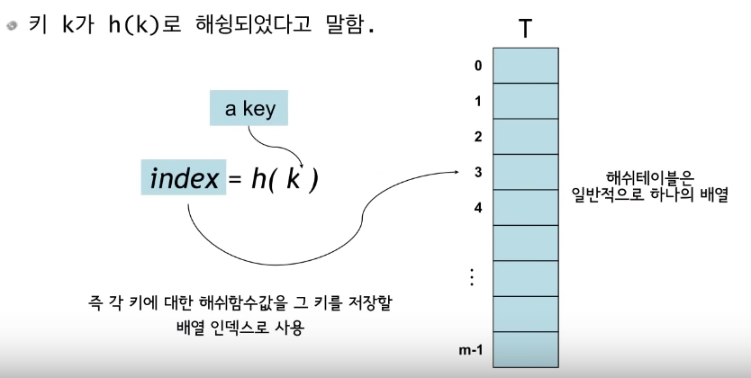
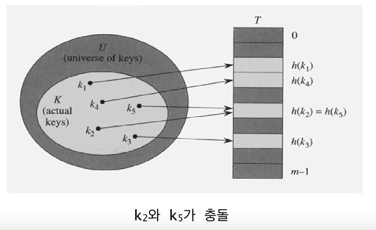
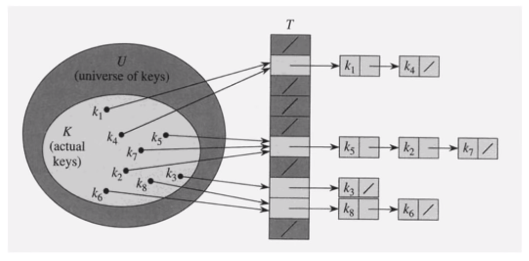
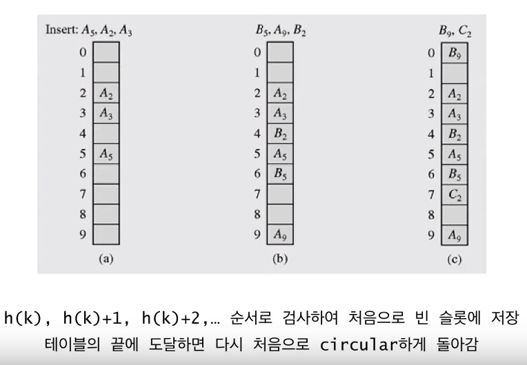
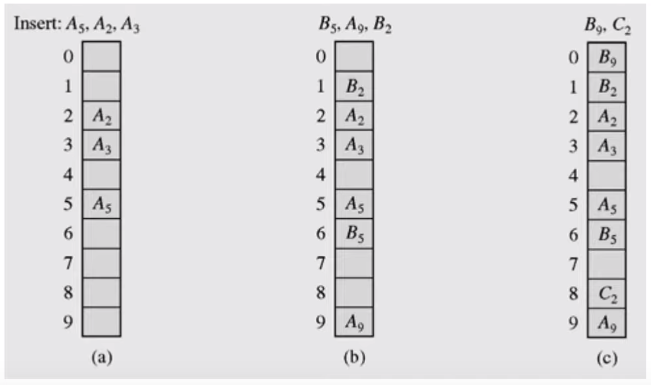
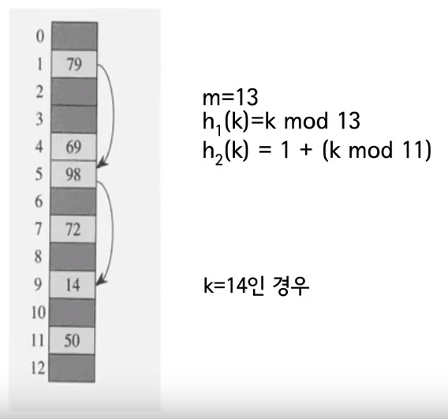
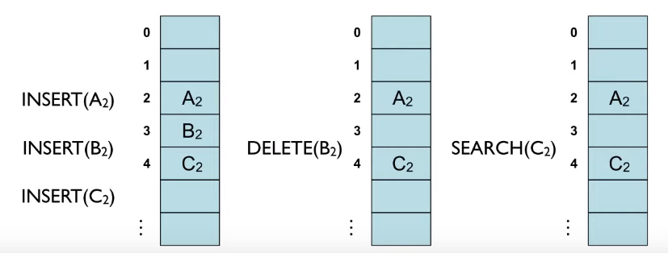
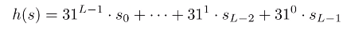

# Hasing Table

- 이전에는 Tree을 사용하여 dynamic set을 구현하는 법을 알아보았다.
- 이번에는 해쉬 테이블을 사용해서 구현하는 법에 대해 알아본다.
- 해쉬 테이블은 dynamic set을 구현하는 효과적인 방법의 하나
  - 적절한 가정하에서 평균 탐색, 삽입, 삭제 시간 O(1)
  - 보통 최악의 경우 O(n), search, insert, delete
- 해쉬 함수 h를 사용하여 키 k를 T[h(k)] 에 저장
  - h : U -> {0, 1, ..., m-1},
  - 여기서 m은 테이블의 크기, U는 모든 가능한 키들의 집합




- 해쉬 테이블은 하나의 배열이라고 생각하면 됨 

- 해쉬 함수를 통해 나온값을 그 키를 저장할 인덱스로 사용해서 저장하는 방식
- 예를 들어, U는 양의 정수들을 집합, h(x) = x % m 이라고 가정, 그러면 결과는 0 ~ m-1 의 값이 나온 것이다. 
- m = 100, x = 1024, h(1024) = 24, 배열의 24 인덱스에 값을 저장하겠다는 의미


# 해쉬 함수의 예

- 모든 키들을 자연수라고 가정 (어떤 데이터든지 자연수로 해석하는 것이 가능)
- 예 : 문자열
  - ASCII 코드 : C = 67, L = 76, R = 82, S = 83
  - 문자열 CLRS는 (67x128^3) + (76x128^2) + (82x128^1) + (83x128^0) = 141,764,947, (128진수)
- 해쉬 함수의 간단한 예 :
  - h(k) = k % m, 즉 key를 하나의 자연수로 해석한 후 테이블의 크기 m으로 나눈 나머지
  - 항상 0 ~ m-1 사이의 정수가 됨


# 충돌(collision)

- 두 개 이상의 키가 동일한 위치로 해슁되는 경우
- 즉, 서로 다른 두 키 k1, k2에 대해서 h(k1) = h(k2)인 상황
- 일반적으로 |U| >> m 이므로 항상 발생 가능(즉 단사함수(일대일 함수)가 아님
- |U| : U라는 집합의 사이즈, 원소의 갯수, 이 갯수가 0 ~ m-1 범위보다 클 경우 충돌 경우가 발생할 수 있다.
- 만약 |K| > m 이라면 당연히 발생, 여기서 K는 실제로 저장된 키들의 집합
- 충돌이 발생할 경우 대처 방법 필요
- 대표적인 두 가지 충돌 해결 방법 : **chaining**과 **open addressing**





# Chaining에 의한 충돌 해결

- 동일한 장소로 해슁된 모든 키들을 하나의 연결리스트(Linked List)로 저장




- 테이블의 각각의 칸에 키를 저장하지 않고 대응하는 데이터들을 연결리스트 형식으로 저장한다.
- **키의 삽입**
  - 키 k를 리스트 T[h(k)] 의 맨 앞에 삽입 : 시간복잡도 O(1)
  - 중복된 키가 들어올 수 있고 **중복 저장이 허용되지 않는다면** 삽입시 리스트를 검색해야 함. 따라서 시간복잡도는 **리스트의 길이에 비례**
- **키의 검색**
  - 리스트 T[h(k)] 에서 **순차검색**
  - 시간복잡도는 키가 저장된 **리스트의 길이에 비례**
- **키의 삭제**
  - 리스트 T[h(k)] 로부터 키를 검색 후 삭제
  - 일단 키를 검색해서 찾은 후에는 O(1) 시간에 삭제 가능


- **최악의 경우**는 모든 키가 하나의 슬롯으로 해슁되는 경우
  - 길이가 n 인 하나의 연결리스트가 만들어짐
  - 따라서 최악의 경우 탐색 시간은 O(n) + 해쉬함수 계산시간
  - 아무리 해쉬함수를 잘 구현해서 계산시간을 줄인다고 해도 |U|의 크기가 m, n 보다 큰 관계가 된다면 최악의 경우가 발생할 수 있다.
- 평균시간복잡도는 키들이 여러 슬롯에 얼마나 잘 분배되느냐에 의해서 결정


# SUHA(Simple Uniform Hashing Assumption)

- 각각의 키가 모든 슬롯들에 균등한 확률로 독립적으로 해슁된다는 가정
  - 성능분석을 위해서 주로 하는 **가정**
  - hash 함수는 determinisitc 하므로 **현실에서는 불가능**
- Load factor ⍺ = n / m
  - n : 테이블에 저장될 키의 개수
  - m : 해쉬테이블의 크기, 즉 연결리스트의 개수
  - 각 슬롯에 저장된 키의 평균 개수
- 연결리스트 T[j] 의 길이를 nj라고 하면 E[nj] = ⍺
- 만약 n = O(m) 이면 평균검색시간은 O(1)


# Open Addressing에 의한 충돌 해결

- 모든 키를 해쉬 테이블 자체에 저장
- 테이블의 각 칸에는 1개의 키만 저장
- 충돌 해결 기법
  - Linear probing
  - Quadratic probing
  - Double hashing


# Linear probing




- 먼저 해슁을 해서 그 칸이 비어있으면 그 슬롯에 저장, 만약 슬롯이 다른 키에 의해 차있을 때는 B5는 5번 슬롯에 저장되어야 하지만 이미 다른 값이 있으므로  그 다음 슬롯부터 조사해서 빈 슬롯을 찾아서 넣는다.

- B9의 경우에도 9번 슬롯에 A9이 있으므로 그 다음 슬롯부터 빈 슬롯을 찾아 가장 가까운 슬롯에 저장한다.
- 인덱스가 끝이면 다시 0 번 인덱스로 돌아가서 동작 수행
- 이렇게 저장을 한다면 search는 어떻게 할까?, 먼저 해슁을 한 다음 찾는다. 바로 맞으면 끝이고 아니라면 그 다음 슬롯부터 첫 빈 슬롯까지 해서 찾는 키가 있는지 search
- 이런 의미에서는 연결 리스트 방법과 비슷하다.
- Linear probing의 단점
  - primary cluster : 키에 의해서 채워진 연속된 슬롯들을 의미
  - 이런 cluster가 생성되면 이 cluster는 점점 더 커지는 경향이 생김
  - 이렇게 되면 검색을 할 때 처음으로 빈 칸이 나올때까지 검색하므로 클러스터의 길이에 비례하는 시간이 걸리므로 단점이 된다, 다른 말로는 원래 저장된 위치에서 점점 멀리 떨어진다고 말할 수 있다.
- **Quadratic probing**
  - Linear probing의 단점을 개선하고자 만듬, cluster가 커지는 것을 probing 하는 순서를 바꿔서 +1이 아니라 연속적으로 저장하지 않고 제곱으로 해주므로 cluster 문제를 완화되어 보이지만 완벽하지는 않다. 다만 cluster 문제를 줄일 수는 있다.
  - 충돌 발생시 h(k), h(k)+1^2, h(k)+2^2, h(k)+3^2, ...  순서로 시도



- B2의 경우 1^2, 2^2, 3^2, 4^2 과정을 거쳐서 1번 자리에 들어갔다.

- 여기서 1^2 자리에 있으면 그 다음 자리부터해서 i^2 다음 칸에 있는지 확인 후 비어있을 때 가지 이 과정을 반복


- **Double probing**
  - 아예 해슁 함수 2개를 만들어서 처음에는 h1 함수만을 사용해서 비어있으면 그 자리에 넣고 자리에 있으면 아래와 같은 함수를 사용해서 넣음.
  - 두 함수의 식을 사용해서 값이 있다면 i를 증가시켜 사용.
  - 서로 다른 두 해쉬 함수 h1과 h2를 이용.
  - h(k, i) = (h1(k) + i x h2(k)) mod k




# Open Addressing - 키의 삭제

- 단순히 키를 삭제할 경우 문제가 발생
  - 가령 A2, B2, C2 가 순서대로 모두 동일한 해쉬함수 값을 가져서 linear probing 으로 충돌 해결 (왼쪽 그림)
  - B2를 삭제한 후(가운데 그림) C2를 검색 
  - 검색을 하면 A2 다음에 자리가 비워져 있기 때문에 C2는 없다고 판단하여 문제가 발생
  - 키를 삭제시 mark를 해두어 해결할 수 있지만 key 삽입, 삭제를 여러 번 할 경우 모든 슬롯이 mark 될 수 있다. 이로 인해 테이블 전체를 봐야할 수도 있다.
  - mark가 좋은 아이디어는 아니다. 그래서 일반적으로 B2 삭제 후 그 자리에  C2를 옮긴다. 따라서 삭제시 추가적인 동작이 필요하게 된다.




# 좋은 해쉬 함수란?

- 현실에서는 키들이 랜덤하지 않음.
- 만약 키들의 통계적 분포에 대해 알고 있다면 이를 이용해서 해쉬 함수를 고안하는 것이 가능하겠지만 현실적으로 어려움.
- 키들이 어떤 특정한 패턴을 가지더라고 해쉬 함수 값이 불규칙적이 되도록 하는 게 바람직.
  - **해쉬 함수 값이 키의 특정 부분에 의해서만 결정되지 않아야 함.**
- 키의 값이 비슷하더라도 해쉬 함수의 값은 아예 달라야 함.


## Division 기법

- 키를 테이블 사이즈로 나눠서 구하는 방법
- 일반적으로 해쉬 함수 가장 마지막 단계에서 하는 작업, 0 ~ m-1 사이의 값을 만들어낼 수 있으므로.
- h(k) = k mod m
- 예 : m = 20 and k = 91 -> h(k) = 11
- 장점 : 한 번의 mod 연산으로 계산, 따라서 빠름
- 단점 : 어떤 m 값에 대해서는 해쉬 함수 값이 키 값의 특정 부분에 의해서 결정되는 경우가 있음, 가령 m = 2^p 이면 키의 하위 p 비트가 해쉬 함수 값이 됨


## Multiplication 기법

- Division 기법의 단점을 보완하기 위해 Division 기법이 가장 마지막에 들어가고 그 중간 단계에 여러 기법들을 사용되는 데 그 중 하나인 Multiplication 기법에 대해 알아본다.
- 2 개의 키가 비슷하더라도 이 과정을 거치면 최종 결과가 어떻게 나올 지 예측하기 어렵다는 것이 이 기법의 목적
- 0에서 1사이의 상수 A를 선택 : 0 < A < 1 (A는 0.xxxx 소수)
- kA의 소수부분만을 택한다. (k는 key)
- 소수 부분에 m을 곱한 후 소수점 아래를 버린다.
- 예 : m = 8, word size = w = 5, k = 21
  - A = 13 / 32를 선택
  - kA = 21x13 / 32 = 273 /32 = 8 + 17 / 32
  - m (kA mod 1) = 8 x 17 / 32 = 17 / 4 = 4.xxx
  - 즉, h(21) = 4


# Hashing in Java

- Java의 Object 클래스는 hashCode() 메서드를 가짐, 따라서 모든 클래스는 hashCode() 메서드를 상속받는다. 이 메서드는 하나의 32비트 정수를 반환한다.
- 만약 x.equals(y)이면 x.hashCode() == y.hashCode() 이다. 하지만 역은 성립하지 않는다.
- Object 클래스의 hashCode() 메서드는 객체의 메모리 주소를 반환하는 것으로 알려져 있음
- 필요에 따라 각 클래스마다 이 메서드를 override 하여 사용한다.


## 해쉬 함수 예 : hashCode() for Strings in Java

```java
public final class String {
	private final char[] s;
	
	public int hashCode() {
		int hash = 0;
		for (int i = 0; i < length(); i++) {
			hash = s[i] + (31*hash);
		}
		return hash;
	}
}
```



- 31진수 값을 해쉬 함수 결과값으로 사용


## 사용자 정의 클래스의 예

```java
public class Record {
	private String name;
	private int id;
	private double value;
	
	public int hashCode(){
		int hash = 17; // nonzero constant
		hash = 31 * hash + name.hashCode();
		hash = 31 * hash + Integer.valueOf(id).hashCode();
		hash = 31 * hash + Double.valueOf(value).hashCode();
		return hash;
	}
}
```

- **모든 멤버들을 사용하여** hashCode를 생성한다.


# hashCode와 hash 함수

- Hash code : -2^31에서 2^31 사이의 정수, 임의의 32비트 정수, 음수일수도 있음
  - 2^31 = 2147483648
  - 테이블 사이즈를 모르고 임의의 32비트 정수를 리턴해주는 함수
  - 해쉬 코드 자체를 해쉬 함수 값 자체로 쓰는 것이 아니라 다시 테이블 사이즈 안에 들어오는 사이즈로 변환해주는 과정이 필요로 한다. 
- Hash 함수 : 0에서 M-1까지의 정수 (배열 인덱스), 테이블 사이즈가 정해짐

```java
private int hash(Key key) {
	return (key.hashCode() & 0xfffffff) % M;
    // key.hashCode() : 임의의 32비트 정수
    // 0xfffffff : 0으로 시작하고 나머지는 1인 32비트 정수
    // &해주는 이유는 32비트가 뭐든지 간에 첫 비트가 무조건 0이 됨
    // 즉 이 해쉬코드를 양수로 바꿔주는 과정(양수로 바꿔줘야 되는 이유는 나머지 연산 자체가 양수일때 동작하므로 바꿔줘야 한다.)
    // 그 다음 M으로 나눠서 인덱스를 구해준다.
}
```

- Java에서는 보통 위와 같이 hash 함수를 사용, 하지만 암호학에서 hash 함수와 다르다. 여기서의 hash는 검색을 위한 함수, 암호학에서 사용하는 hash는 복잡한 함수 사용.


# HashMap in Java

- 4장에서 다룬 TreeMap 클래스와 유사한 인터페이스를 제공(둘 다 java.util.Map 인터페이스를 구현)
- 내부적으로 하나의 배열을 해쉬 테이블로 사용
- 해쉬 함수는 바로 위 해쉬 함수와 유사
- chaining으로 충돌 해결
- load factor를 지정할 수 있음 (0 ~ 1 사이의 실수)
- 저장된 키의 개수가 load factor를 초과하면 더 큰 배열을 할당하고 저장된 키들을 재배치 (re-hashing)


# HashSet in Java

- Set 집합 데이터 타입을 구현

```java
HashSet <Mykey> set = new HashSet<MyKey> ();
set.add(MyKey);
if(set.contains(theKey))
	...
int k = set.size();
set.remove(theKey);
Iterator <MyKey> it = set.iterator();
while (it.hasNext()) {
	MyKey key = it.next();
	if(key.equals(aKey))
		if.remove();
}
```

