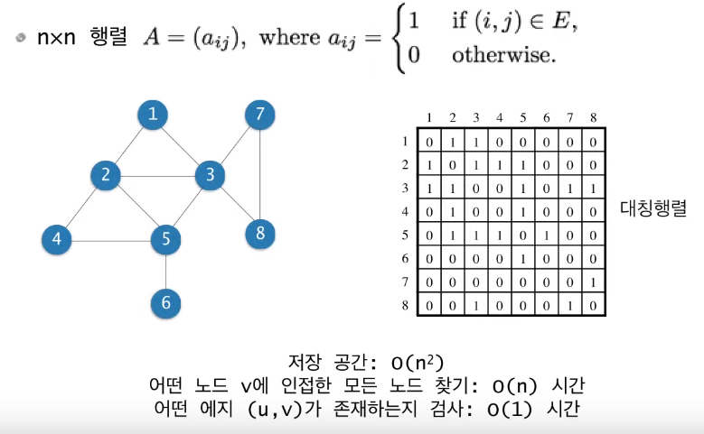

# Graph 개념과 표현

# 그래프

- (무방향(undirected)) 그래프 G = (V, E)
  - V : 노드 혹은 정점(vertex)
  - E : 노드 쌍을 연결하는 edge 혹은 link
  - 개체들 간의 이진 관계를 표현
  - n = |V|, m = |E|

# 방향 그래프와 가중치 그래프

- 방향 그래프(Directed Graph) G = (V, E)
  - edge (u, v)는 u로부터 v로의 방향을 가짐.
  - (u, v)와 (v, u)는 서로 다르다.

- 가중치(weighted) 그래프
  - edge마다 가중치가 지정

# 그래프의 표현

## 인접행렬 (adjacency matrix)

- 정점의 갯수가 n개인 그래프를 2차원 배열로 표현한 것, 2차원 배열 안에 값이 1이면 해당 인덱스 노드 사이에 edge가 있다는 뜻이다.

- 이 2차원 배열은 대칭 행렬이다.

## 인접리스트 (adjacency list)

- 정점 집합을 표현하는 하나의 배열과 각 정점마다 인접한 정점들의 연결리스트

- 저장 공간 : O(n+2m) = O(n+m) 
- 인접리스트에서는 찾고자 하는 노드의 시간복잡도는 연결리스트의 길이만큼 시간이 걸린다. O(degree(v)), 최악의 경우 O(n)이 될 수 있다.

# 방향 그래프

- 인접행렬은 비대칭
- 인접리스트는 m개의 노드를 가짐

# 가중치 그래프의 인접행렬 표현

- edge의 존재를 나타내는 값으로 1 대신 edge의 가중치를 저장
- edge가 없을 때 혹은 대각선 :
  - 특별히 정해진 규칙은 없으며, 그래프와 가중치가 의미하는 바에 따라서 저장
  - 예 : 가중치가 거리 혹은 비용을 의미하는 경우라면 edge가 없으면 무한, 대각선은 0
  - 예 : 만약 가중치가 용량을 의미한다면 edge가 없으면 0, 대각선은 무한

# 경로와 연결성

- 무방향 그래프 G = (V, E)에서 노드 u와 노드 v를 연결하는 경로(path)가 존재할 때 v와 u는 서로 연결되어 있다고 말함
- 모든 노드 쌍들이 서로 연결된 그래프를 **connected 그래프**라고 한다.
- 연결요소 (connected component)

- 두 노드가 직접 연결되어 있을 때는 인접하다라고 말하고 두 노드가 직접 연결되어있지 않아도 경로가 있으면 연결되어 있다고 말한다.