# 순회 - 그래프에서의 BFS


# 그래프 순회

- 순회 (traversal)
  - 그래프의 모든 노드들을 방문하는 일
- 대표적 2 가지 방법
  - BFS (Breadth-First Search, 너비우선순회)
  - DFS (Depth-First Search, 깊이우선순회)


# 너비우선순회 (BFS)

- BFS 알고리즘은 다음 순서로 노드들을 방문

  - L0 = {s}, 여기서 s는 출발 노드

  - L1 = L0의 모든 이웃 노드들

  - L2 = L1의 이웃들 중 L0에 속하지 않는 노드들

    ....

  - Li  = L(i-1)의 이웃들 중 L(i-2)에 속하지 않는 노드들


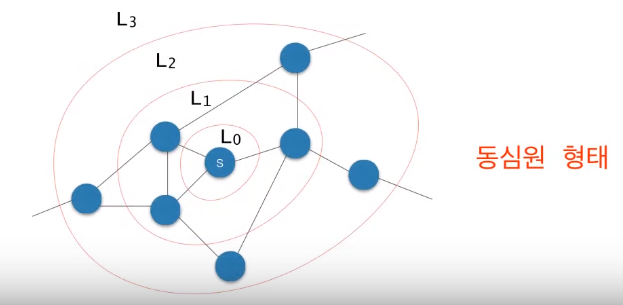


- BFS는 노드들을 동심원 형태로 방문, 출발 노드를 지정해야 한다.


# 큐를 이용한 너비우선순회

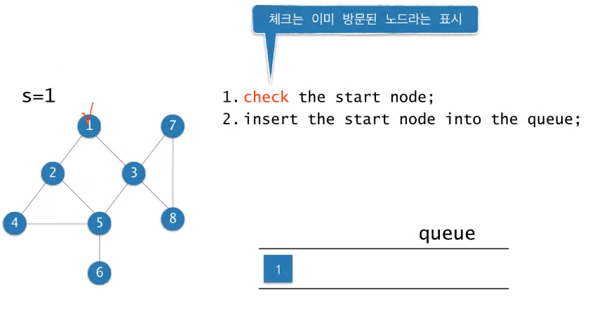


- Level order traversal이 BFS의 이진트리버전


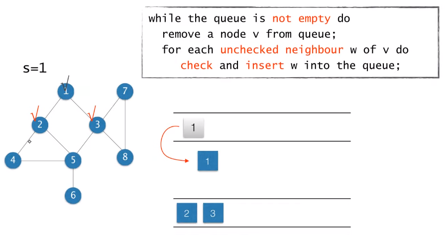

- 큐가 비어있을 때까지 반복하고 안에 노드가 있으면 제거하고 V와 인접하고 방문하지 않은 노드를 체크하고 큐에 넣는다.


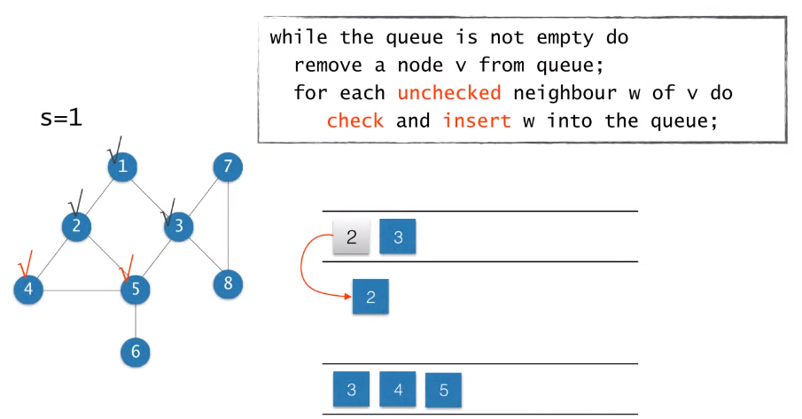


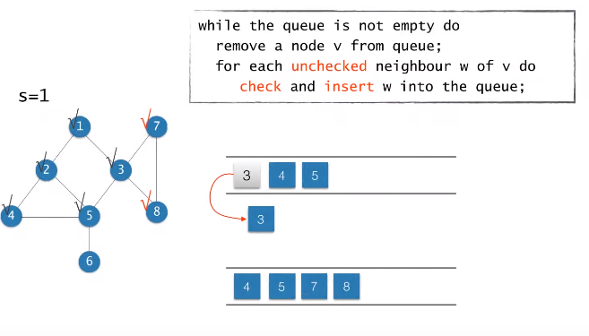


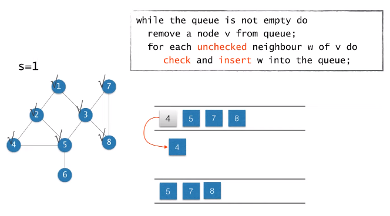


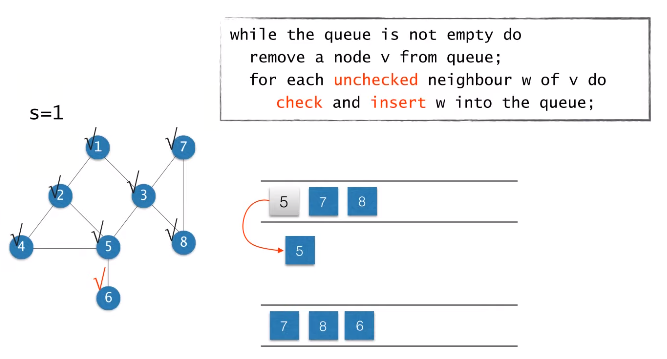


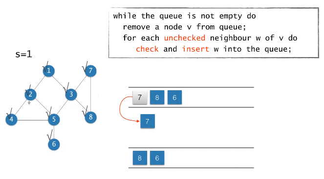

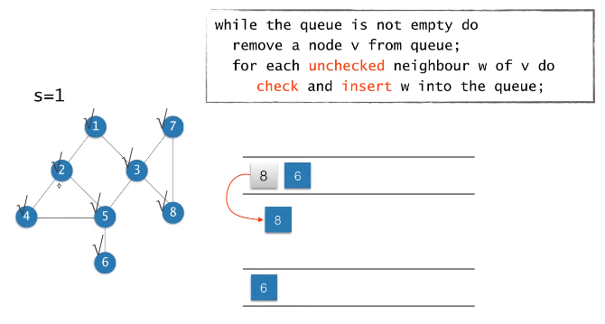


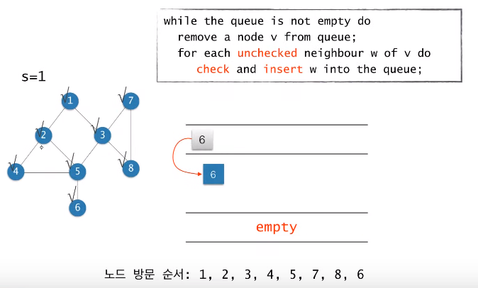

- 노드 방문 순서는 유일하지 않다. 예를 들어 2와 3을 무엇부터 넣는냐에 따라 달라질 수 있다.


```
BFS(G, s) // 그래프, 출발 노드
	Q <- empty; // 처음의 큐는 empty 상태
	Enqueue(Q, s);// 큐에 출발노드를 넣음
	while Q != empty do // 큐가 비어있을때 동안 반복
		u <- Dequeue(Q) // 큐에서 하나를 꺼냄 
		for each v adjacent to u do // u의 인접한 각각의 노드
			if v is unvisited then //체크 안되어있으면
				mark v as visited; // 체크하고
				Enqueue(Q, v); // 그 노드를 큐에 넣는다.
			end.
		end.
	end,
```


# BFS와 최단경로

- BFS를 이용해서 출발노드에서 해당 노드까지의 최단경로를 구할 수 있다.

- s에서 Li에 속한 노드까지의 최단 경로의 길이는 i이다. (여기서 경로의 길이는 경로에 속한 edge의 개수를 의미한다.)
- BFS를 하면서 각 노드에 대해서 최단 경로의 길이를 구할 수 있다.

- 입력 : 방향 혹은 무방향 그래프 G = (V, E), 그리고 출발노드 s∈V
- 출력 : 모든 노드 v에 대해서
  - d[v] = s로부터 v까지의 최단 경로의 길이(edge의 개수)
  - π[v] = s로부터 v까지의 최단경로상에서 v의 직전 노드(predecessor)


```
BFS(G, s)
	Q <- empty;
	d[s] <- 0;  /* distance from s to s is 0 */
	//출발점으로부터 s까지니까 0
	π[s] <- null;  /* no predecessor of s */
	//출발점이니까 나에게 도달하기 직전 노드가 없음
	Enqueue(Q, s);
	while Q != empty do
		u <- Dequeue(Q)
		for each v adjacent to u do
			if v is unvisited then
			//보통 모든 노드들에 대해서 d[v]를 -1로 초기화해두고, -1이면 unvisited, 아니면 visited로 판단한다.
				mark v as visited;
				d[v] <- d[u] + 1;  /* distance to v */
				//이전 노드의 길이 + 1
				π[v] <- u;  /* u is the predecessor of v */
				//직전 노드가 u
				Enqueue(Q, v);
		end.
	end.		
	
	* O(n + m) with adjacent list
```


```
BFS(G, s)
	Q <- empty;
	for each node u do
		d[u] <- -1;
		π[u] <- null;
	end.
	d[s] <- 0; π[s] <- null;
	Enqueue(Q, s);
	while Q != empty do
	//while 문을 한 번 돌 때마다 큐에서 하나를 꺼내므로 최대 n번 돈다.
		u <- Dequeue(Q)
		for each v adjacent to u do 
		//인접리스트로 구현할 경우 for문은 각 노드 v에 대해서 degree(v) 번 돈다.
			if (d[v] == -1) then
				d[v] <- d[u] + 1;
				π[v] <- u;
				Enqueue(Q, v);
				//unchecked 노드만 queue에 들어갈 수 있으므로 어떤 노드도 큐에 두 번 들어가지는 않는다.
		end.
	end.
```

- 인접리스트로 구현할 경우 시간복잡도는 O(n+m)


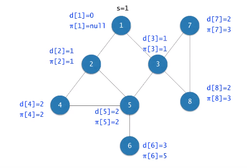


# BFS 트리

- 각 노드 **v**와 **π[v]**를 연결하는 edge들로 구성된 트리


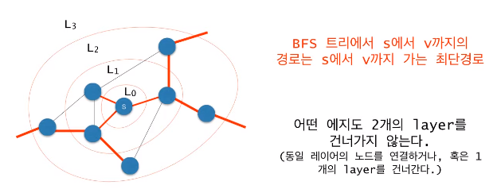


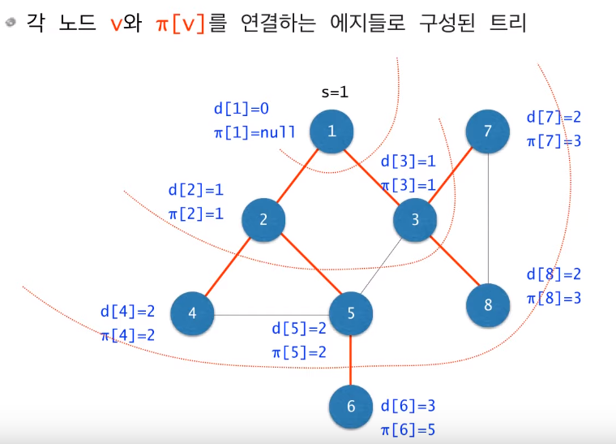


# 너비우선순회: 최단 경로 출력하기

```
PRINT-PATH(G, s, v) // 출발점 s에서 노드 v까지의 경로 출력하기
	if v=s then
		print s;
	else if π[v]=null then //s에서 v까지의 경로가 존재하지 않는 경우
		print "no path from s to v exists";
	else
		PRINT-PATH(G, s, π[v]);
		print v;
end.
```


- 그래프가 disconnected이거나 혹은 방향 그래프라면 BFS에 의해서 모든 노드가 방문되지 않을 수도 있음
- BFS를 반복하여 모든 노드 방문

```
BFS-ALL(G) {
	while there exists unvisited node v
		BFS(G, v);
}
```

