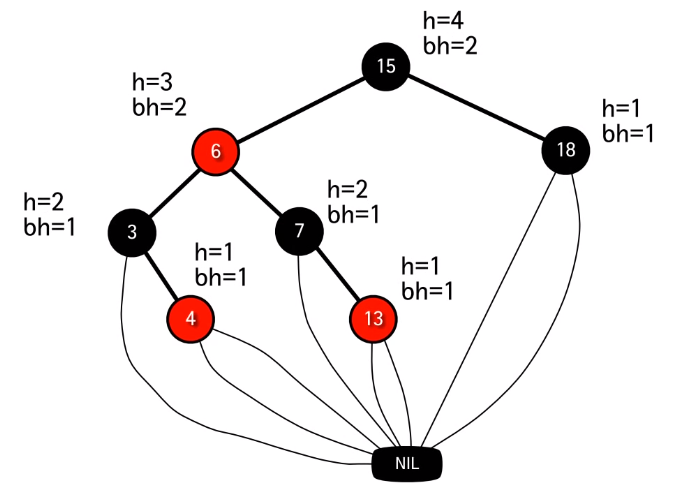
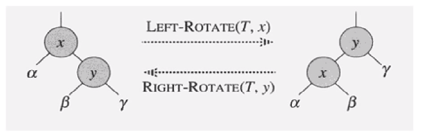
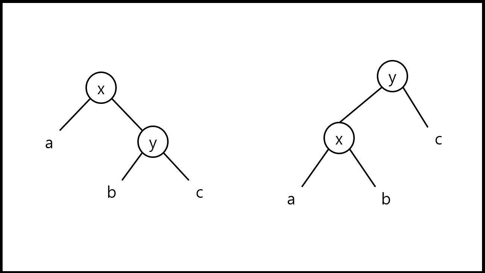
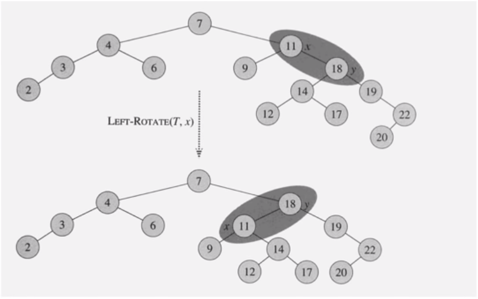

# 레드블랙트리

- BST에서는 search, insert, delete는 O(h), 모두 트리의 높이 h에 비례하는 복잡도를 가지고 있다.
- O(h)는 노드의 개수에 따라 다르기 때문에, n = h 일 경우도 있으므로 최악의 경우 O(n)이 된다. 이는 바람직하지 않다.
- 위와 같은 경우는 트리가 일렬로 쭉 내려오는 경우


- 이진탐색트리의 일종
- BST 알고리즘에서 SEARCH, INSERT, DELETE를 적절히 수정해서 연산 최악의 경우에도 O(logn)
- 균형잡힌 트리 : 높이가 O(logn)


[출처 : [https://ko.wikipedia.org/wiki/%EB%A0%88%EB%93%9C-%EB%B8%94%EB%9E%99_%ED%8A%B8%EB%A6%AC](https://ko.wikipedia.org/wiki/레드-블랙_트리)]


- 각 노드는 하나의 키, 왼쪽 자식, 오른쪽 자식 그리고 부모 노드(p) 의 주소를 저장
- 자식 노드가 존재하지 않을 경우 NIL 노드라고 부르는 특수한 노드가 있다고 가정
- 따라서 모든 리프 노드는 NIL 노드
- 루트의 부모도 NIL 노드라고 가정
- 노드들은 내부 노드와 NIL 노드로 분류
- 실제로 구현할 때 NIL을 구현하지 않아도 되고 설명을 간편하게 하기 위해 NIL 사용하는 것임


# 레드 블랙 트리 : 정의

- 다음 조건을 만족하는 이진탐색트리
  1. 각 노드는 red 혹은 black 이고,
  2. 루트노드는 black 이고,
  3. 모든 리프노드(NIL) 는 black 이고
  4. red 노드의 자식 노드들은 전부 black 이고 (즉, red 노드는 연속되어 등장하지 않는다.)
  5. 모든 노드에 대해서 그 노드로부터 자손인 리프 노드에 이르는 모든 경로에는 동일한 개수의 black 노드가 존재한다.





# 레드 블랙 트리의 높이

- 노드 x의 높이 h(x) 는 자신으로부터 리프 노드까지의 가장 긴 경로에 포함된 에지의 개수이다.
- 노드 x의 블랙 - 높이 bh(x) 는 x 로부터 리프 노드까지의 경로상의 블랙 노드의 개수이다. (노드 x 자신은 불포함)
- 높이가 h인 노드의 블랙-높이는 bh >= h/2 이다.
  - 조건 4에 의해 레드 노드는 연속될 수 없으므로
- 노드 x를 루트로하는 임의의 서브 트리는 적어도 2^bh(x) -1 개의 내부 노드를 포함한다. (수학적 귀납법)
- n 개의 내부 노드를 가지는 레드 블랙 트리의 높이는 2log(n+1) 이하이다.
  - n >= 2^bh - 1 >= 2^(h/2) -1 이므로, 여기서 bh와 h는 각각 루트 노드의 블랙 - 높이와 높이


# Left and Right Rotation

- 이제 레드 블랙 트리의 Search, Insert, Delete를 알아본다. Search 연산은 이진탐색트리와 같기 때문에 BST의 Search 알고리즘과 동일, 실제로 insert와 delete 알고리즘을 본다.
- 그 전에 insert와 delete에 공통적으로 필요로하는 2가지 기본 연산에 대해 알아본다.
- Left, Right Rotation은 BST에서 어느 한 노드를 중심으로 부분적으로 노드의 모양을 수정한다.
- 수정되어도 여전히 BST를 유지한다.
- 시간복잡도 O(1)



- 노드 x에 대해서 left rotate, x의 오른쪽이 존재할 경우에 가능
- 트리의 모양이 x의 오른쪽 자식이 원래 x자리로 가고  자리 이동됨, 자리가 이동되어도 BST 의 조건을 만족한다.
- 베타의 경우 y보다 작고 x보다 크기 x의 오른쪽 자식으로 가도 이진탐색트리 조건을 만족한다.
- 레드 블랙 트리를 left rotation를 하면 레드 블랙 트리가 아니다. 뒤에서 알아봄, 하지만 이진탐색트리의 조건은 만족.


# Left Rotation

- y = right[x] != NIL 이라고 가정
- 루트 노드의 부모도 NIL 이라고 가정

```
LEFT-ROTATE(T, x) { // T: 레드블랙트리, x : 실행할 노드
	y <- right[x] // x의 오른쪽 자식이 존재(기본 조건)
	
	right[x] <- left[y] // y의 왼쪽 자식을 x의 오른쪽 자식으로
	// y와 y의 왼쪽 자식 연결을 끊고 x와 y의 왼쪽 자식을 연결
	
	p[left[y]] <- x // y의 왼쪽 자식의 부모를 x라 한다.
	// 각 노드의 부모의 주소를 저장하기로 했으므로
	
	p[y] <- p[x] // x의 부모를 y의 부모라 해준다.
	// 이제 y가 x 자리로 가므로
	
	if p[x] = nil[T] //x의 부모가 NIL이라면, x 가 현재 루트라면
		then root[T] <- y // y가 새로운 트리의 루트가 됨
		else if x = left[p[x]] // x의 부모노드 왼쪽 자신이 x 이면
			then left[p[x]] <- y // y가 x 부모의 왼쪽 자식이되고
			else right[p[x]] <- y // y가 x 부모의 오른쪽 자식이되고
			
	left[y] <- x // x가 y의 왼쪽 자식이 됨
	p[x] <- y // x의 부모가  y 가 됨
}
```








# INSERT

- 보통의 BST 에서처럼 노드를 INSERT 한다.
- 새로운 노드 z 를 **red** 노드로 한다.
- RB-INSERT-FIXUP 을 호출한다.

```
RB-INSERT(T, z) { // z가 insert할 노드, 노드를 insert
	y <- nil[T]  // 루트 위니까 nil(=null)
	x <- root[T] // 저번 시간에 x, y 두 개의 포인터를 사용해서 insert한다고 했음 
	while x != nil[T]
		do y <- x
			if key[z] < key[x]
				then x <- left[x]
				else x <- right[x]
	
	p[z] <- y
	if y = nil[T] // y가 null 인 경우 empty tree, 새로운 노드가 root 가 됨
		then root[T] <- z
		
		else if key[z] < key[y]
			then left[y] <- z
			else right[y] <- z
			
	// leaf 노드니까 왼쪽, 오른쪽 자식이 nil
	left[z] <- nil[T]
	right[z] <- nil[T]
	// 윗 부분은 BST에서의 INSERT와 동일 
	
	color[z] <- RED // insert 노드를 RED 노드로, 무작정 red로 했기 떄문에 레드 블랙 트리의 조건을 만족시키지 못 할 수도 있다.(red - red)
	RB-INSERT-FIXUP(T, z)  // 조건을 만족시켜주기 위한 함수
}
```


# RB-INSERT-FIXUP

1. 각 노드는 red 혹은 black 이고,
2. 루트노드는 black 이고,
3. 모든 리프노드(NIL) 는 black 이고
4. red 노드의 자식 노드들은 전부 black 이고 (즉, red 노드는 연속되어 등장하지 않는다.)
5. 모든 노드에 대해서 그 노드로부터 자손인 리프 노드에 이르는 모든 경로에는 동일한 개수의 black 노드가 존재한다.

- 위반될 가능성이 있는 조건들
  1. OK. (조건 만족)
  2. 만약 z가 루트노드라면 위반, 아니라면 OK, 단순히 루트 노드를 black으로 바꾸면 됨
  3. OK. (조건 만족)
  4. z의 부모 p[z]가 red이면 위반.
  5. OK. (조건 만족), 새 노드를 red 노드이므로 black 노드의 갯수에는 변함이 없음


- Loop Invariant
  - z는 red 노드
  - 오직 하나의 위반만이 존재한다.
    - 조건 2 : z 가 루트 노드이면서 red 이거나, 또는
    - 조건 4 : z 와 그 부모 p[z] 가 둘 다 red 이거나.
- 종료 조건 :
  - 부모 노드 p[z] 가 black 이되면 종료한다. 조건 2가 위반일 경우 z를 블랙으로 바꾸고 종료


