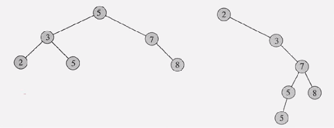
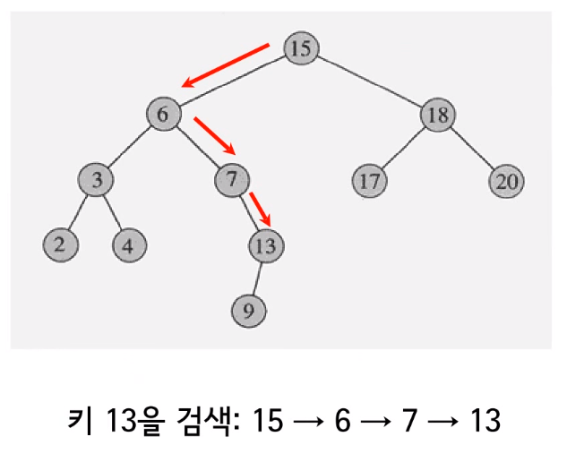
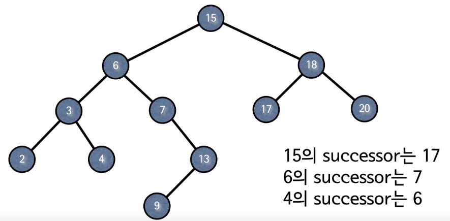
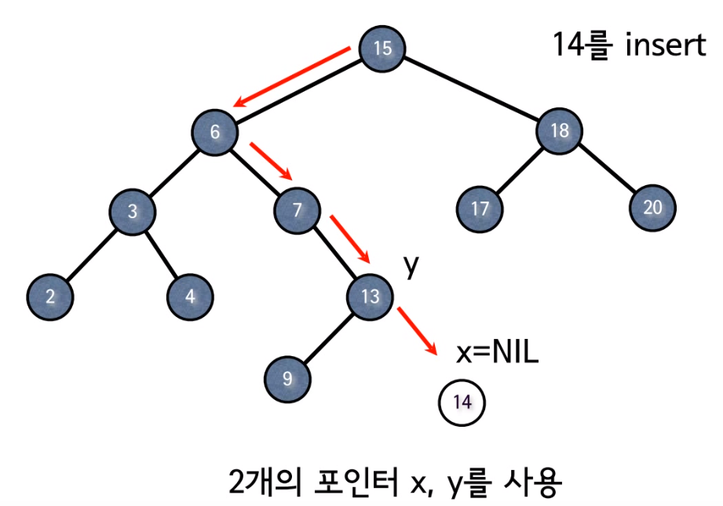
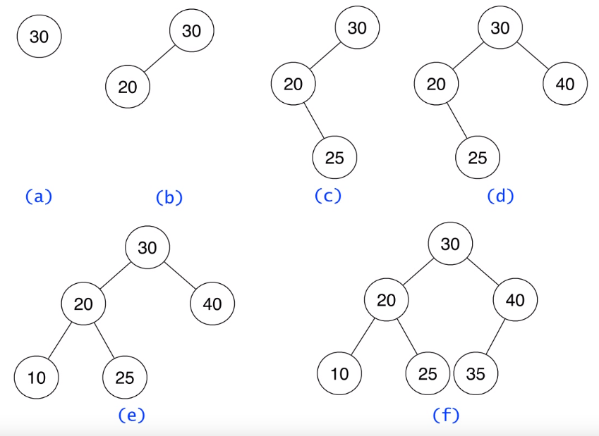
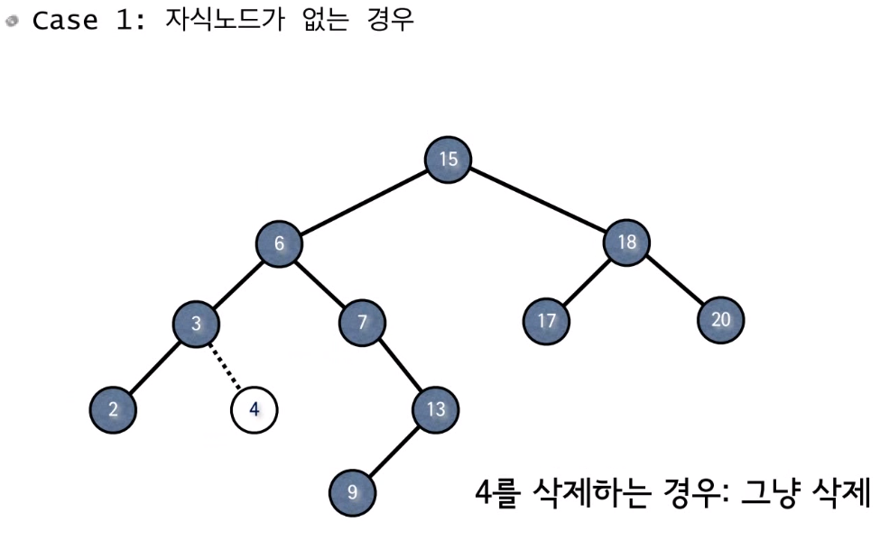
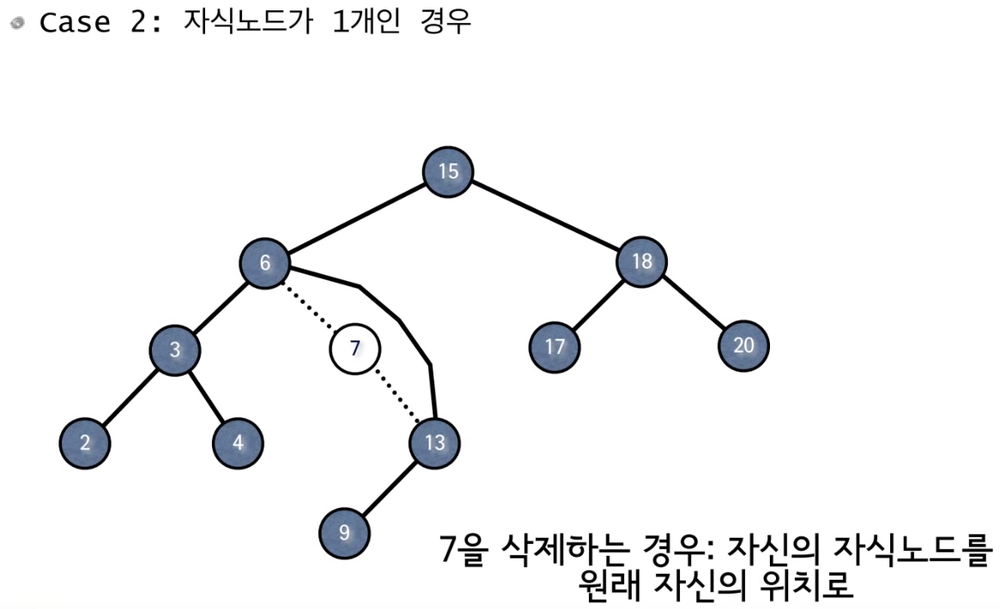
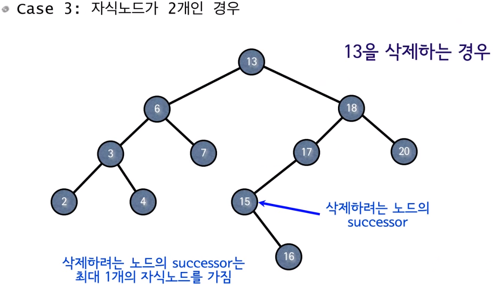
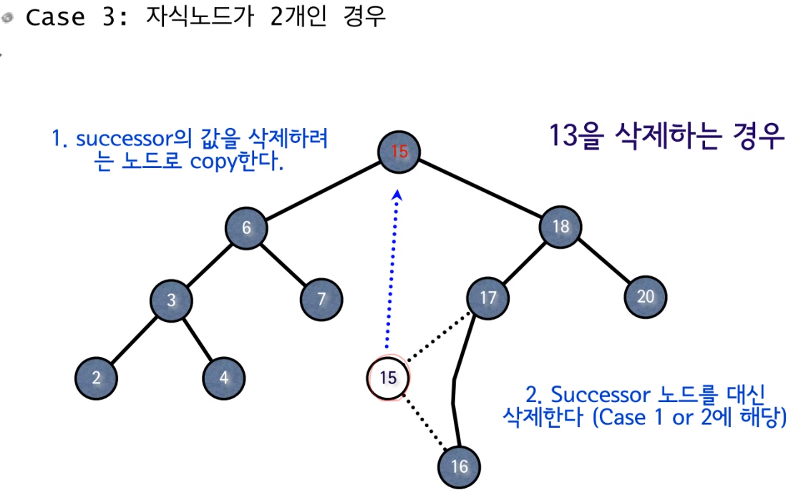

# Binary Search Tree

검색 트리는 일종의 집합, Dynamic Set이라고 부른다. 데이터들이 고정되어 있지 않고 데이터가 추가, 삭제될 수 있다는 것을 의미

- 여러 개의 키를 저장
- INSERT, SEARCH, DELETE 3가지 연산을 지원

Search Structure를 구현한다고 하면 보통 배열, 연결리스트를 사용

|                      | serach  | insert                                      | delete                               |
| -------------------- | ------- | ------------------------------------------- | ------------------------------------ |
| 배열 (정렬 O)        | O(logn) | O(n)                                        | O(n), (앞으로 한칸씩 당겨야 되니까)  |
| 배열 (정렬 X)        | O(n)    | O(1), O(n) (꽉차서 추가할 공간이 없을 경우) | O(1) (찾지않고 삭제하는 경우만 고려) |
| 연결 리스트 (정렬 O) | O(n)    | O(1)                                        | O(n)                                 |
| 연결 리스트 (정렬 X) | O(n)    | O(1)                                        | O(1)                                 |


# 다양한 방법들

- 정렬된 혹은 정렬되지 않은 배열 혹은 연결 리스트를 사용할 경우 INSERT, SEARCH, DELETE 중 적어도 하나는 O(n)
- 세 개 다 이것보다 효율적인 자료구조와 알고리즘은 없는가?
- 이진 탐색 트리, 레드 - 블랙 트리, AVL - 트리 등의 트리에 기반한 구조들
- 해쉬 테이블 등


# 검색 트리

- 검색 트리는 Dynamic set을 SEARCH, INSERT, DELETE를 효율적으로 연산하기 위한 트리이다.

- Dynamic set을 트리의 형태로 구현
- 일반적으로 SEARCH, INSERT, DELETE 연산이 트리의 높이에 비례하는 시간복잡도를 가짐


# 이진 검색 트리 (BST)

- 이진 트리이면서 각 노드에 하나의 키를 저장
- 각 노드 v에 대해서 그 노드의 왼쪽 서브트리에 있는 키들을 key[v] 보다 작거나 같고, 오른쪽 서브트리에 있는 값은 크거나 같다.



- Binary heap과 BST는 서로 다름, BST는 특정 조건이 없다. heap은 max heap property를 만족해야 한다. BST는 왼쪽 아래에는 작거나 같아야 하고, 오른쪽 아래는 크거나 같아야 한다. 서로 조건이 다르다.


# SEARCH



- BST는 SEARCH, INSERT, DELETE를 효율적으로 하기 위한 트리이다.

```java
TREE-SEARCH(x, k) { // x 는 루트 노드, k는 찾는 값
	if x = NULL or k = key[x] //key[x] 노드 x에 저장된 값
		then return x
	if k < key[x] //작으면 왼쪽, 크다면 오른쪽으로 recursion
		then return TREE-SEARCH(left[x], k)
		else return TREE-SEARCH(right[x], k)
}
```

## 시간복잡도 O(h), h는 트리의 높이


```java
ITERATIVE-TREE-SEARCH(x, k) {
	while x != NULL and k != key[x]
		do if k < key[x]
			then x <- left[x]
			else x <- right[x]
	return x
}
```


# BST에서 최소값 찾기

- 최소값은 왼쪽 자식이 없어야 하고 왼쪽 서브 트리에 속해야 한다.
- 루트부터 시작해서 계속 왼쪽으로 내려가면 찾을 수 있다.
- 최소값은 항상 가장 왼쪽 노드에 존재

```java
TREE-MINIMUM (x) {
	while left[x] != NULL // 가장 끝 왼쪽 노드일 때까지 반복
		do x <- left[x]
	return x
}
```

## 시간복잡도  O(h)


## 최대값

```java
TREE-MAXIMUM (x) {
	while right[x] != NULL // 가장 끝 오른쪽 노드일 때까지 반복
		do x <- right[x]
	return x
}
```


# Successor

- BST에서 successor는 노드에 저장된 데이터를 크기 순으로 정렬했을 때 나 다음에 오는 값, 나보다 크면서 가장 작은 값을 successor라고 한다.
- 노드 x의 successor란 key[x]보다 크면서 가장 작은 키를 가진 노드
- 모든 키들이 서로 다르다고 가정




## Successor를 구할 때 3 가지 경우

- 노드 x의 오른쪽 서브트리가 존재할 경우, 오른쪽 서브트리의 최소값 (오른쪽 서브트리로 간 다음 왼쪽으로 더 이상 갈 수 없을 때까지 탐색)
- 오른쪽 서브트리가 없는 경우, 부모를 따라 루트까지 올라가면서 처음으로 누군가의 왼쪽 자식이 되는 노드
- 그런 노드 y가 존재하지 않을 경우 successor가 존재하지 않음 (즉, x가 최대값)


```java
TREE-SUCCESSOR (x) { // 노드 x의 successor 찾기
	if right[x] != NULL // 오른쪽 자식이 있다면
		then return TREE-MINIMUM(right[x]) // 오른쪽 서브트리에서의 최소값
	
	y <- p[x]  // 오른쪽 서브트리가 없을 경우, p[x]는 x의 부모 노드
	while y != NULL and x = right[y] //오른쪽 자식인 동안 반복됨
		do x <- y 
		      y <- p[y]
	return y
}
```

## 시간복잡도 O(h)


# Predecessor

- 노드 x의 predecessor란 key[x] 보다 작으면서 가장 큰 키를 가진 노드
- Successor와 반대, 대칭이기 때문에 right를 left로 바꾸면 됨

```java
TREE-SUCCESSOR (x) {
	if left[x] != NUL
		then return TREE-MINIMUM(left[x])
	
	y <- p[x] 
	while y != NULL and x = left[y]
		do x <- y 
		      y <- p[y]
	return y
}
```

## 시간복잡도 O(h)


# BTS에서의 INSERT



- 이진 트리에서 새로운 데이터를 추가할 때 기존에 있는 데이터들은 변경하지 않고 들어갈 수 있는 leaf 자리에 추가한다.
- 먼저 15와 비교해서 작으니 왼쪽으로, 6과 비교해서 크므로 오른쪽, 7보다 크므로 오른쪽 13보다 크므로 오른쪽, 그 아래 leaf 노드에 추가된다.
- x, y 한 칸 차이씩 따라다님




- BTS에서 노드를 delete 하지 않는다면 맨 처음 들어온 노드가 계속 root 자리를 차지하고 있음


```java
TREE-INSERT (T, z) { // T : Tree, z : insert 할 노드
	y <- NULL // 맨 처음
	x <- root[T] // 맨 처음, root 노드
	while x != NULL 
		do y <- x // y의 자식으로 새로운 데이터 insert
			if key[z] < key[x]  // 왼쪽, 오른쪽 자식인지 결정
				then x <- left[x]
				else x <- right[x]
	// while 문 종료되면 x는 NULL, y는 leaf의 부모
         p[z] <- y // 새로운 노드의 부모는 y 가 된다.
	if y = NULL  // x 가 null일 경우, 원래 트리가 empty tree 일 경우, 새 노드를 추가하면 그 노드가 root가 된다.
		then root[T] <- z
		else if key[z] < key[y]
			then left[y] <- z
			else right[y] <- z
}
```

## 시간복잡도 O(h)


# DELETE

- BST에서 DELETE는 자식 노드가 없는 경우, 자식 노드가 1개인 경우, 2개인 경우에 따라 다르다.



- 가장 단순한 경우, 이 노드를 삭제, 삭제한다는 것은 부모의 노드 오른쪽 자식 필드를 NULL로 바꿔주면 된다.




- 연결리스트와 같은 선형적은 구조 (6 - 7 -13), 6의 오른쪽 자식을 7의 오른쪽 자식으로 해줘면 된다.
- 다르게 말하면 나의 위치에 내 자식 노드를 위치시킨다라고 보면 된다.




- 13을 지우면 복잡해지니 13 노드 안의 데이터만 지우고 노드는 그대로 둔다.
- 그런 다음 삭제 노드의 successor 데이터를 가져온다, 삭제되는 노드의 가장 근접한 수
- 왜냐하면 BST는 조건이 있기 때문에(왼쪽 서브트리는 작거나 같고, 오른쪽 서브 트리는 크거나 같다) 13이 제거되고 가장 근접한 값을 가져오는 것이 가장 좋다.
- 단점은 만약 트리의 각 노드에 저장된 데이터 양이 크다면 문제가 될 수 있다. 하지만 트리를 만들 경우 데이터를 직접 저장하는 경우보다는 객체를 이용해서 저장해서 사용하는 경우도 있으므로 경우에 따라 크게 문제가 안 될수도 있다.
- successor를 찾아서 삭제 노드 자리에 데이터를 옮긴다.
- successor가 들어가는 것이 좋은 이유는 그대로 왼쪽 서브 트리에 대해 조건을 만족하고 오른쪽도 만족하기 때문이다.
- BST의 조건인 크기 관계가 훼손되지 않는다!
- successor는 자식 노드가 0개 또는 1개, 왼쪽 자식이 x, 따라서 case 1, case 2처럼 삭제하면 된다.




 

```
TREE-DELETE(T, z) { //  T : Tree, z : 삭제할 노드, 삭제할 노드를 찾아서 주소를 넘겨주면 삭제됨, y가 삭제
	if left[z] = NULL or right[z] = NULL // 자식 노드가 0개 또는 1개
		then y <- z // y는 실제로 삭제할 노드
		else y <- TREE-SUCCESSOR(z) // y는 실제로 삭제할 노드, 자식 노드가 2개
		
	//노드 y 삭제 과정	
	if left[y] != NULL  // 왼쪽 자식이 존재한다면, 오른쪽 자식은 없음, 왜냐하면 0개 또는 1개니까
		then x <- left[y]
		else x <- right[y]
	if x != NULL // 이 노드 y를 삭제하고 x를 y로 올리면 된다.
	//현재 x의 부모가 y임
		then p[x] <- p[y]
	if p[y] = NULL  // y 가 루트라면
		then root[T] <- x
		else if y = left[p[y]] //y가 루트가 아니고 부모노드가 있다면
			then left[p[y]] <- x
			else right[p[y]] <- x
			
	if y != z //case 3, 원래 삭제노드와 실제 삭제노드가 다르다면, copy 해주는 일을 해준다.
	//삭제 노드가 아니라 successor 노드를 삭제할 경우
		then key[z] <- key[y]
			copy y's satellite data into z
	return y
}
```


# BST

- 각종 연산의 시간복잡도 O(h)
- 그러나 최악의 경우 트리의 높이 h = O(n)
- 균형잡힌 트리
  - 레드 - 블랙 트리 등
  - 키의 삽입이나 삭제시 추가로 트리의 균형을 잡아줌으로써 높이를 O(logn)으로 유지

