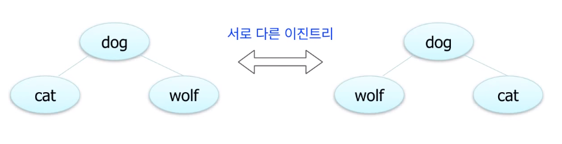
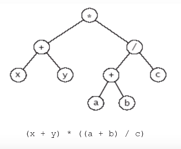
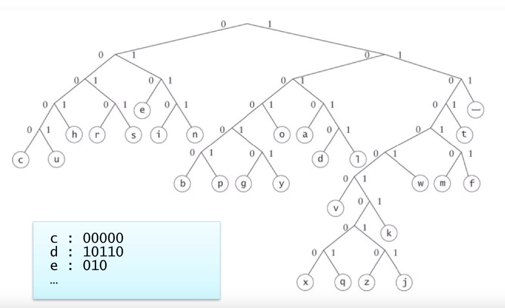
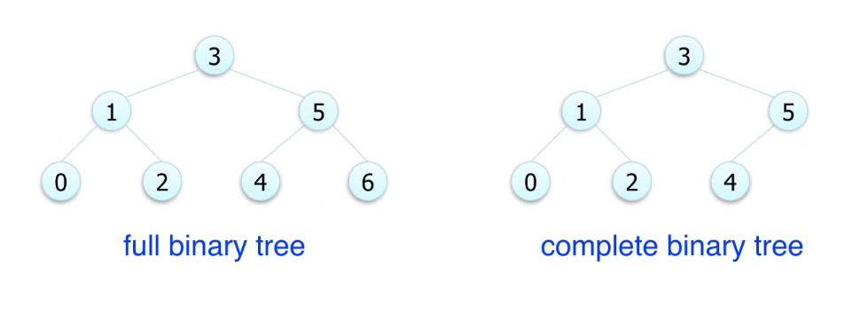
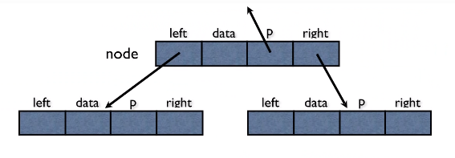
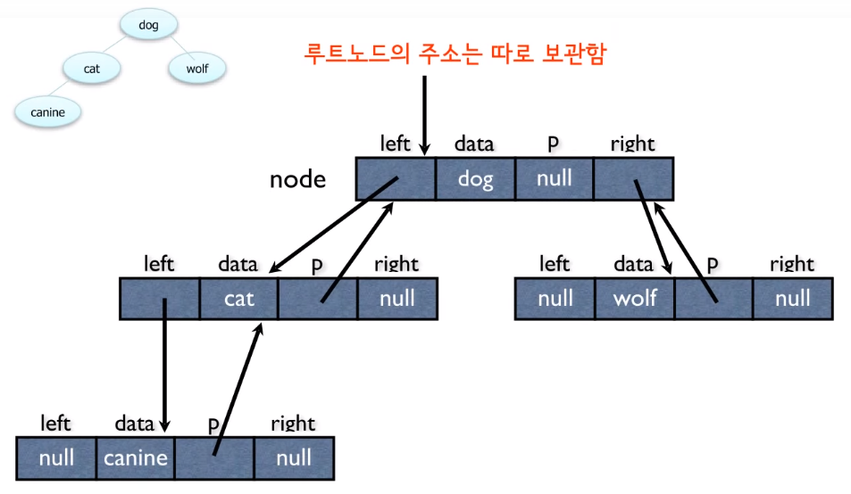
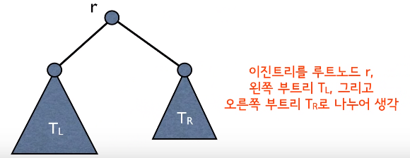
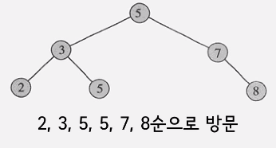
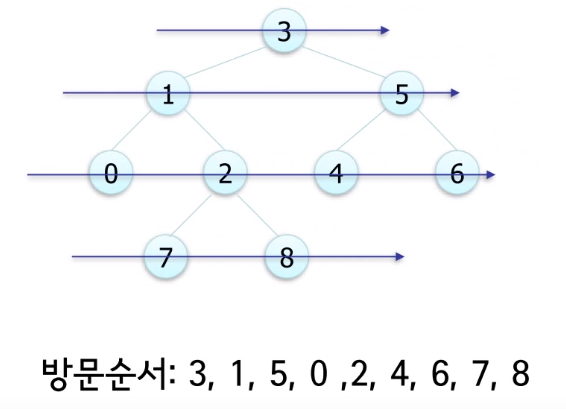

# 트리와 이진트리

- 트리는 계층적인 구조를 표현, 조직도, 디렉터리와 서브디렉터리, 가계도
- 트리는 노드들과 노드들을 연결하는 link들로 구성됨
- 노드들을 연결하는 선을 link, edge, branch 등으로 부름
- 맨 위의 노드를 root 노드라고 한다.
- 부모가 동일한 노드들을 형제(sibling) 관계라고 부름
- 자식이 없는 노드들을 leaf 노드라고 부름
- leaf 노드가 아닌 노드들을 internal 노드라고 부름
- 부모 - 자식 관계를 확장한 것이 조상 - 자손 관계
  - ex) dog - cat - canine  / dog는 canine의 조상 노드이다.
- 트리에서 어떤 한 노드와 그 노드의 자손들로 이루어진 트리를 서브 트리라고 한다.
- 레벨, root는 레벨 1, 2, 3 순으로 내려간다.
- 경우에 따라서 레벨 0부터 시작할 수도 있음
- 서로 다른 레벨의 갯수를 높이라고 한다.


# 트리의 기본적인 성질

- 노드가 N개인 트리는 항상 N-1 개의 링크를 가진다.
- 트리에서 루트에서 어떤 노드로 가는 경로는 유일하다. 또한 임의의 두 노드 간의 경로로 유일하다. (같은 노드를 2 번 이상 방문하지 않는다는 조건 하에)


# 이진 트리 (Binary Tree)

- 이진 트리에서 각 노드는 최대 2 개의 자식을 가진다.
- 각각의 자식 노드는 자신이 부모의 왼쪽 자식인지 오른쪽 자식인지가 지정된다.




# 이진 트리의 응용 : Expression Tree



- 수식을 어떤 순서로 계산해야 되는지를 나타낸 트리


# 이진 트리의 응용 : Huffman Code



- 어떤 데이터를 압축, 인코딩하는 것을 나타낸 것
- 파일 압축과 관련된 알고리즘
- c 는 00000로 인코딩하겠다는 의미


# Full and Complete Binary Trees



- 높이가 h인 full binary tree는 2^h - 1 개의 노드를 가진다.
- 노드가 N 개인 full 혹은 complete 이진 트리의 높이는 O(logN)이다.


# 이진 트리의 표현

## 연결 구조(Linked Structure) 표현



- 각 노드에 하나의 데이터 필드와 왼쪽 자식, 오른쪽 자신 그리고 부모 노드(p)의 주소를 저장
- 부모 노드의 주소는 반드시 필요한 경우가 아니면 보통 생략




- Java로 노드 객체를 생성해서 구현하면 됨


# 이진 트리의 순회(traversal)

- 순회 : 이진 트리의 모든 노드를 방문하는 일
- inorder 순회
- preorder 순회
- postorder 순회
- level - order 순회





## inorder 순회

- 먼저 TL을 inorder로 순회
- r을 순회
- TR을 inorder로 순회
- TL -> r -> TR
- 순회는 recursive 하다.



```java
INORDER-TREE-WALK(x) { // x는 루트 노드, TL -> r -> TR
	if x != null { // 노드가 존재한다면
		then INORDER-TREE-WALK(left[x]) // 왼쪽 자식의 subtree를 순회
			print key[x] // 방문 노드 출력
			INORDER-TREE-WALK(right[x]) // 오른쪽 자식의 subtree를 순회
	}
}
```


## PREORDER

```java
PREORDER-TREE-WALK(x) {  // r -> TL -> TR 순서
	if x != null {
		then PREORDER-TREE-WALK(left[x])
			print key[x]
			PREORDER-TREE-WALK(right[x])
	}
}
```


## POSTORDER

```java
POSTORDER-TREE-WALK(x) {  // TL -> TR -> r 순서
	if x != null {
		then POSTORDER-TREE-WALK(left[x])
			print key[x]
			POSTORDER-TREE-WALK(right[x])
	}
}
```


# Level - Order 순회

- 레벨 순으로 방문, 동일 레벨에서는 왼쪽에서 오른쪽 순서
- 큐를 이용하여 구현



```
LEVEL-ORDER-TREE-TRAVERSAL () {
	visit the root;
	Q <- root; // Q는 큐를 의미
	while Q is not empty do
		v <- dequeue(Q);
		visit children of v;
		enqueue children of v into Q;
}
```

