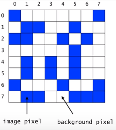
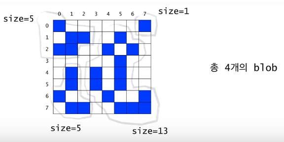
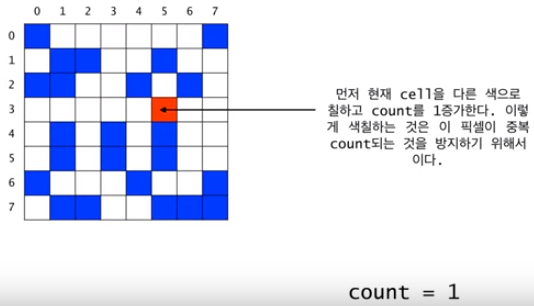
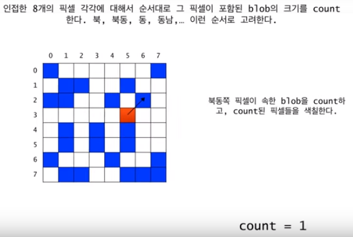
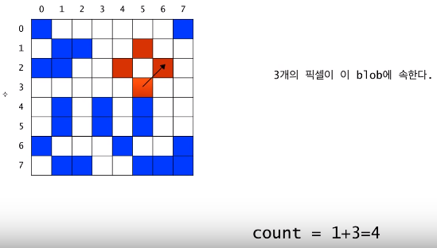
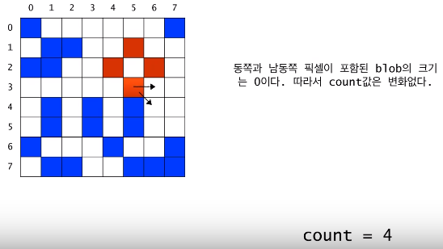
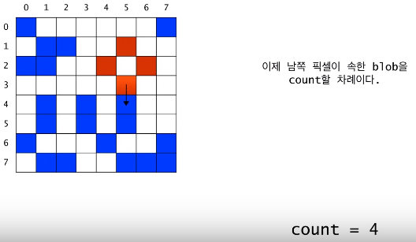
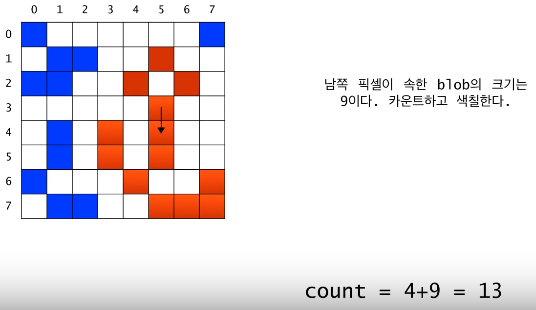
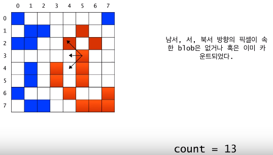

# Recursion의 응용 : Counting Cells in a Blob



- 이 문제는 하나의 Binary 이미지가 주어진다. 

- 각 픽셀은 background pixel이거나 혹은 image pixel.

- 서로 연결된 image pixel들의 집합을 blob라고 부름

- 상하좌우 및 대각 방향으로도 서로 연결된 것으로 간주





- 입력
  - N*N 크기의 2차원 그리드
  - 하나의 좌표(x,y)
- 출력
  - (x, y)가 포함된 blob의 크기
  - (x, y)가 어떤 blob에도 속하지 않는 경우에는 0


### Recursive Thinking

현재 픽셀이 속한 blob의 크기를 카운트하려면

현재 픽셀이 image color가 아니라면

​	0을 반환

현재 픽셀이 image color라면

​	먼저 현재 픽셀을 카운트한다.(count = 1)

​	현재 픽셀이 중복 카운트되는 것을 방지하기 위해 다른 색으로 칠한다.

​	현재 픽셀에 이웃한 모든 픽셀들(8개)에 대해서

​		그 픽셀이 속한 blob의 크기를 카운트하여 카운터에 더해준다.

​	카운터를 반환한다.




---


---



---



---



---



---



---



---

```
Algorithm for countCells(x,y)
if the pixel (x,y) is outside the grid
	the result is 0;
else if pixel (x,y) is not an image pixel or already counted
	the result is 0;
else
	set the color of the pixel (x,y) to a red color;
	the result is 1 plus the number of cells in each piece of
	the blob that includes a nearest neighbour;
```


```java
private static int BACKGROUND_COLOR = 0;
private static int IMAGE_COLOR = 1;
private static int ALREADY_COUNTED = 2;

public int countCells(int x, int y) {
    if(x < 0 || x >= N || y < 0 || y >= N)
        return 0;
    else if(grid[x][y] != IMAGE_COLOR)
        //backgroud거나 이미 counted 된 곳
        return 0;
    else {
        grid[x][y] = ALREADY_COUNTED;
        return 1 + countCells(x-1, y+1) + countCells(1, y+1) + countCells(x+1, y+1) + countCells(x-1, y) + countCells(x+1, y) + countCells(x-1, y-1) + countCells(x, y-1) + countCells(x+1, y-1);
    }
}
```

