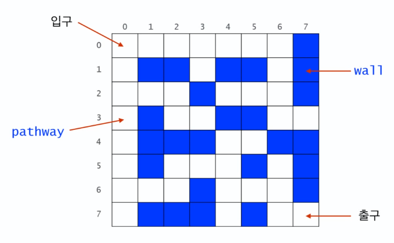

# Recursion의 응용 - 미로찾기 1




## Recursive Thinking

- 현재 위치에서 출구까지 가는 경로가 있으려면
  1. 현재 위치가 출구이거나 혹은
  2. 이웃한 셀들 중 하나에서 현재 위치를 (다시)지나지 않고 출구까지 가는 경로가 있거나


## Decision Problem

- 답이 yes or no인 문제
- 출발점에서 출구까지 가는 경로가 있느냐 없느냐로 답하는 문제

```java
boolean findPath(x,y) {
	if(x,y) is the exit {
		return true;
	}
	else {
		for each neighbouring cell (x', y') of (x, y) do {
			if(x', y') is on the pathway {
				if findPath(x', y') {
					return true;	
				}
			}
		}
		return false; 
        //인접한 셀 모두 벽이거나 통로까지 가는 경로가 없는 경우
	}
}
```

- 문제가 없어보이지만 무한 루프에 빠지지는 않는가 생각해봐야 한다.
- 다음 셀이 이전 셀이 될 수 있으니 무한 루프에 빠질 수 있다.
- 이전 셀을 다시 가지 않도록 해줘야 한다.


```java
boolean findPath(x,y) {
	if(x,y) is the exit {
		return true;
	}
	else {
		mark(x,y) as a visited cell;
		for each neighbouring cell (x', y') of (x, y) do {
			if(x', y') is on the pathway and not visited {
				if findPath(x', y') {
					return true;	
				}
			}
		}
		return false; 
        //인접한 셀 모두 벽이거나 통로까지 가는 경로가 없는 경우
	}
}
```

- 이 셀은 방문했었다고 흔적을 남긴다.
- 일반적으로 재귀를 설계할 때 그 전에 벽이 아닌지 방문한 지점이 아닌지 설계할 수 있지만 그렇게 하지 않고 x, y에 인접한 셀에 대해서 벽인지, 방문된 점인지 확인하지 않고 벽이나 방문했으면 종료하는 방법이 있다. 재귀 함수 호출은 더 많아지겠지만 코드 상 더 이해하기 쉽다. 이전 코드와 크게 다를 바 없다.


```java
boolean findPath(x,y) {
	if (x,y) is either on the wall or a visited cell {
		return false;
	}
	else if(x,y) is the exit {
		return true;
	}
	else {
		mark(x,y) as a visited cell;
		for each neighbouring cell (x', y') of (x, y) do {
			if findPath(x', y') {
				return true;	
			}
		}
		return false; 
        //인접한 셀 모두 벽이거나 통로까지 가는 경로가 없는 경우
	}
}
```


```java
public class Maze {
	private static int N=8;
	private static int [][] maze = {
		{0,0,0,0,0,0,0,1},
		{0,1,1,0,1,1,0,1},
		{0,0,0,1,0,0,0,1},
		{0,1,0,0,1,1,0,0},
		{0,1,1,1,0,0,1,1},
		{0,1,0,0,0,1,0,1},
		{0,0,0,1,0,0,0,1},
		{0,1,1,1,0,1,0,0}
	};
	
	private static final int PATHWAY_COLOUR=0;
	//지나갈 수 있는 통로
    private static final int WALL_COLOUR=1;
    //벽
	private static final int BLOCKED_COLOUR=2;
    //visited이며 출구까지의 경로 상에 있지 않음이 밝혀진 cell
	private static final int PATH_COLOUR=3;
    //visited이며 아직 출구로 가는 경로가 될 가능성이 있는 cell
    
    public static boolean findMazePath(int x, int y) {
        if(x<0 || y<0 || x>=N || y>=N) {
            //유효한 범위인가 2차원 배열 범위 넘어서 인지 체크
            return false;
        }
        else if(maze[x][y] != PATHWAY_COLOUR) {
            //이미 visited 셀, 벽
            return false;
        }
        else if(x==N-1 && y==N-1) {
            //바로 출구인 부분
            maze[x][y] = PATH_COLOUR;
            return true;
        }
        else {
            maze[x][y] = PATH_COLOUR;
            // 방문했으며 아직 꽝인지는 확실히 모르는 경우
            if(findMazePath(x-1,y) || findMazePath(x,y+1) || findMazePath(x+1,y) || findMazePath(x,y-1)) {
                return true;
            }
            maze[x][y] = BLOCKED_COLOUR; //dead end
            return false;
        }
    }
    
    public static void main(String[] args) {
        findMazePath(0,0);
        
    }
}
```

