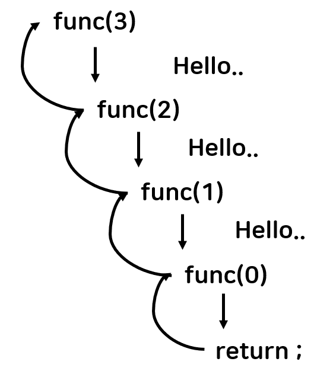
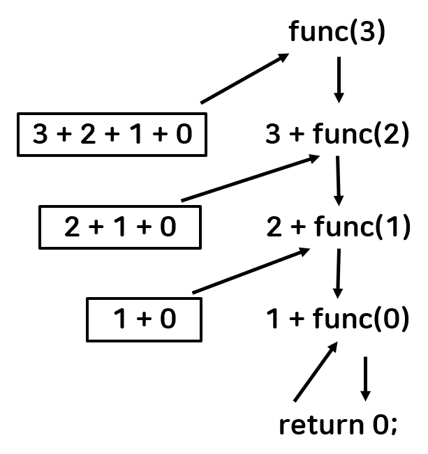
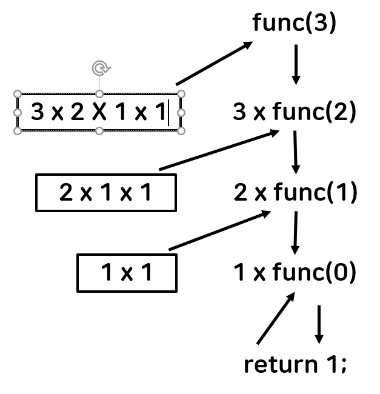

# 순환(Recursion)의 개념과 기본 예제 1

## 개념

- 자기 자신을 다시 호출하는 함수, 메소드
- 순환, 재귀 함수라고도 한다.
- 자기 함수 내에서 자기 자신을 다시 호출한다.

- 정지 조건을 주지 않으면 무한 루프가 형성되기 때문에 조심해야 한다.
- 자기 자신을 호출하는 함수라고 했는데 어떤 일을 하고 다시 호출하기 때문에 무한 루프에 빠지기 쉽다.

```java
public class Main {
	public static void main(String[] args) {
		int n = 3; 
		func(n);
	}
	
	public static void func(int k) {
		if(k <= 0) {
			return;
		}
		else {
			System.out.println("Hello..");
			func(k-1);
		}
	}
}
```





```java
if(k <= 0)
{
	return;
}
```

- **Base case** : 적어도 하나의 recursion에 빠지지 않은 경우가 존재해야 한다.


```java
else
{
	System.out.println("Hello..");
	func(k-1);
}
```

- **Recursive case** : recursion을 반복하다보면 결국 base case로 수렴해야 한다.


```java
public class main {
	public static void main(String[] args) {
		int result = func(3);
	}
	
	public static int func(int n) {
		if(n==0) {
			return 0;
		}
		else {
			return n + func(n-1);
		}
	}
}
```




- 0부터 입력한 값까지 더한 값을 구하는 재귀 함수이다.

- 이 함수의 mission은 0 ~ n까지 합을 구하는 것이다.
- return n + func(n-1); 부분을 보면 n이 0보다 크다면 0에서 까지의 합은 0에서 n-1까지의 합에 n을 더한 것이다.


## 수학적 귀납법으로 표현

정리 : func(int n)은 음이 아닌 정수 n에 대해서 0에서 n까지의 합을 올바로 계산한다.

증명 :

1. n = 0 인 경우 : 0을 반환한다.
2. 임의의 양의 정수 k에 대해서 n < k 인 경우 0에서 n까지의 합을 올바르게 계산하여 반환한다고 가정하자.
3. n =k인 경우를 고려해보자. func은 먼저 func(k-1) 호출하는데 2번의 가정에 의해서 0에서 k-1까지의 합이 올바로 계산되어 반환된다. func은 그 값에 n을 더해서 반환한다. 따라서 func은 0에서 k까지의 합을 올바로 계산하여 반환한다.


## Factorial n!

0! = 1

n! = n x (n-1)! (n>0)

```java
public class Main {
	public static void main(String[] args) {
		factorial(3);
	}
	
	public static int factorial(int n) {
        if(n==0) {
            return 1;
        }
        else {
            return n*factorial(n-1);
        }
    }
}
```





## X^n 계산하기

- x^0 = 1
- x^n = x * x^(n-1) (n > 0)

```java
public class Main {
	public static void main(String[] args) {
		System.out.println(power(2, 3));
	}
	
	public static int power(int x, int n) {
		if(n==0) {
			return 1;
		}
		else {
			return x * power(x, n-1);
		}
	}
}
```


## Fibonacci Number

- f0 = 0
- f1 = 1
- fn = f(n-1) + f(n-2) (n > 1)

```java
public class Main {
	public static void main(String[] args) {
		System.out.println(fibonacci(4));
	}
	
	public static int fibonacci(int n) {
		if(n==0) {
            return 0;
        }
        else if(n==1) {
            return 1;
        }
        else {
            return fibonacci(n-1) + fibonacci(n-2);
        }
	}
}
```


## 최대 공약수 : Euclid Method

### 유클리드 호제법

- 최대공약수를 구하는데 소인수 분해로 구하는 방법 이외에 유클리드 호제법이 있다.

- 호제법이란 말은 두 수가 서로 상대방의 수를 나누어서 결국 원하는 수를 얻는 알고리즘을 뜻한다.

- 2개의 자연수 a, b에 대해서 a를 b로 나눈 나머지를 r이라 하면(단, a>b), a와 b의 최대공약수는 b와 r의 최대공약수와 같다. 이 성질에 따라 b를 r로 나눈 나머지 r'를 구하고, 다시 r을 r'로 나눈 나머지를 구하는 과정을 반복하여 나머지가 0이 되었을 때 나누는 수가 a와 b의 최대 공약수이다.

#### 예시) 1071과 1029의 최대 공약수 구하기

- 1071은 1029로 나누어 떨어지지 않기 때문에, 1071을 1029로 나눈 나머지를 구한다. 42
- 1029는 42로 나누어 떨어지지 않기 때문에, 1029를 42로 나눈 나머지를 구한다. 21
- 42는 21로 나누어 떨어진다. 따라서 최대 공약수는 21이다.

```java
public class Main {
	public static void main(String[] args) {
		System.out.println(gcd(12, 18));
	}
	
	public static int gcd(int x, int y) {
        if(x<y){
            int temp = x;
            x = y;
            y = temp;
        }
       	if((x%y)==0) {
            return y;
       	}
       	else { 
           	return gcd(y, x%y);
       	}
	}
}
```


- 좀 더 간단한 버전, 이 경우 항상 x가 y보다 클 필요가 없다.

```java
public class Main {
	public static void main(String[] args) {
		System.out.println(gcd(1071, 1029));
	}
	
	public static int gcd(int x, int y) {
        if(y==0) {
        	return x;
        }
        else {
        	return gcd(y, x%y);
        }
	}
}
```

