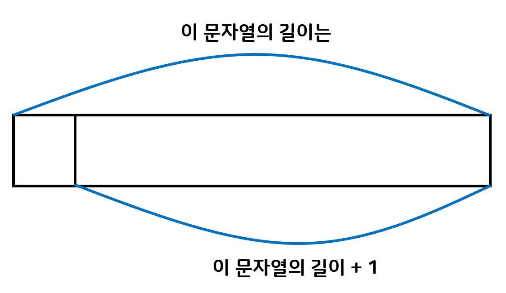

# 순환(Recursion)의 개념과 기본 예제 2

## Recursive Thinking 순환적으로 사고하기

- 재귀 함수는 수학함수뿐만 아니라 다른 많은 문제들을 해결할 수 있다.


## 문자열의 길이 계산




```java
public class Main {
	public static void main(String[] args) {
		System.out.println(substr("abcdefg"));
	}
	
	public static int substr(String str) {
		if(str.length()==0){
			return 0;
		}
		else {
			return 1 + substr(str.substring(1,str.length()));
		}
	}
}
```


```java
public class Main {
	public static void main(String[] args) {
		System.out.println(substr("abcdefg"));
	}
	
	public static int substr(String str) {
		if(str.equals("")){
			return 0;
		}
		else {
			return 1 + substr(str.substring(1));
            //str.substring(1)은 맨 처음 문자를 제거한 후 문자열
		}
	}
}
```


## 문자열 하나하나 프린트

입력으로 들어온 하나의 문자열을 한글자씩 출력하는 메소드 

```java
public class Main {
    public static void main(String[] args) {
		printStr("ABCDEF");        
    }
    
    public static void printStr(String str) {
        if(str.length() == 0 ){
            return ;
        }
        System.out.println(str.chatAt(0));
        printStr(substring(1));
    }
}
```


## 문자열을 뒤집어 프린트

```java
public class Main {
	public static void main(String[] args) {
		reverseStr("ABCDEF");
	}
    
    public static void reverseStr(String str) {
        if(str.length()==0) {
			return ; 	           
        }
        else {
            reverseStr(str.substring(1));
            System.out.print(str.charAt(0));
        }
    }
}
```


## 2진수로 변환하여 출력

```java
public class Main {
    public static void main(String[] args) {
 		binary(30);       
    }
    	
    public static void binary(int n) {
        if(n < 2) {
            System.out.print(1);
        }
        else {
            binary(n/2);
            System.out.println(n%2);
        }
    }
}
```


## 배열의 합 구하기

- data[0]에서 data[n-1]까지의 합을 구하여 반환하시오.

```java
public class Main {
	public static void main(String[] args) {
        int data[] = {1,2,3,4};
        int n = 0;
        System.out.println(arrSum(data, n));	
	}
	
	public static int arrSum(int data[], int n) {
        if(n==(data.length-1)) {
             return data[n];
        }
        else {
            return data[n] + arrSum(data,n+1);
        }
	}
}
```


```java
public class Main {
	public static void main(String[] args) {
        int data[] = {1,2,3,4};
        System.out.println(arrSum(data, data.length));	
	}
	
	public static int arrSum(int data[], int n) {
        if(n<=0) {
             return 0;
        }
        else {
            return data[n-1] + arrSum(data,n-1);
        }
	}
}
```


## Recursion vs Iteration

- 모든 재귀 함수는 반복문(Iteration)으로 변경 가능
- 그 역도 성립, 즉 모든 반복문은 recursion으로 표현 가능
- 재귀 함수는 복잡한 알고리즘을 단순하고 알기 쉽게 표현하는 것을 가능하게 함, 하지만 함수 호출에 따른 오버헤드가 있음 (매개변수 전달, 액티베이션 프레임 생성 등)