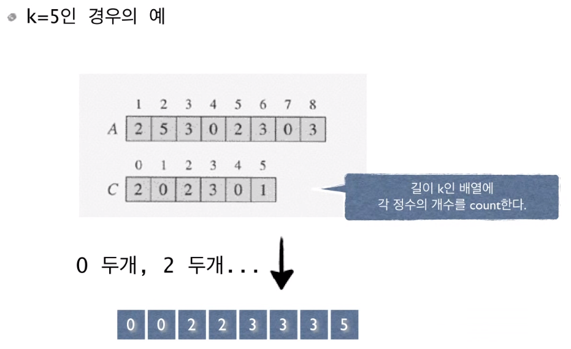
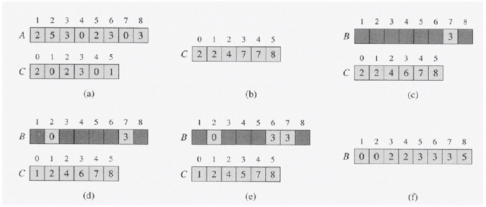

# sorting in linear time

# 선형시간 정렬 알고리즘 O(n)

- O(n) 이므로 comparison sort는 아니다.


# Counting Sort

- n 개의 정수를 정렬하라. 단 모든 정수는 0에서 k사이의 정수이다. (사전 지식)
- k가 비교적 작은 경우에 적용할 수 있는 정렬 알고리즘
- 예 : n 명의 학생들의 시험점수를 정렬하라. 단 모든 점수는 100 이하의 양의 정수이다.





```
int A[n];
int C[k] = {0, };
for(int i = 1; i <= n; i++) {
	C[A[i]]++;
}
for(int s = 1, i = 0; i <= k; i++) {
	for(int j = 0; j < C[i]; j++) {
		A[s++] = i;
	}
}
```

- 만일 사람 이름, 나이, 키 등 데이터가 여러 개 라면 정렬이 되지 않된다.
- 대부분의 경우 정렬한 Key 값들은 레코드의 일부분이기 떄문에 제대로 된 정렬이 되지 않는다.
- 따라서 추가적인 과정이 필요




- (b) 에서는 해당 인덱스보다 작거나 같은 수의 갯수를 나타낸 것이다.
- 그리고 B 배열에 들어가는 숫자의 순서는 A 배열의 뒤의 인덱스 값부터 들어간다.
- 진행하면서 들어간 숫자의 갯수를 마이너스 해주면서 A 배열 0 인덱스 까지 넣어주면 끝이 난다.


# 수도 코드

```
COUNT-SORT(A,B,k) {
	for i <- 0 to k
		do C[i] <- 0 // Count 배열을 0으로 초기화
	for j <- 1 to length[A]
		do C[A[j]] <- C[A[j]] + 1 // 어떤 값이 나올 때 마다 카운트 1씩 증가
	> C[i] now contains the number of elements equal to i
	
	for i <- 1 to k
		do C[i] <- C[i] + C[i-1] // C[i-1] 누적합
	> C[i] now contains the number of elements less than or equal to i.
	
	for j <- length[A] downto 1 // A 배열 거꾸로 부터
		do B[C[A[j]]] <- A[j] // 내가 저장할 값의 인덱스 카운터를 배열 B의 인덱스로 사용해서 저장
			C[A[j]] <- C[A[j]] -1 // 그 다음 숫자로 이동
	
}
```


# 시간 복잡도

- O(n + k) (일반적으로, n > k) = O(n)
- k가 클 경우 비실용적
- 이 알고리즘은 Stable 정렬 알고리즘이라고 불린다.
  - 입력에 동일한 값이 있을 때 입력에 먼저 나오는 값이 출력에서도 먼저 나온다.