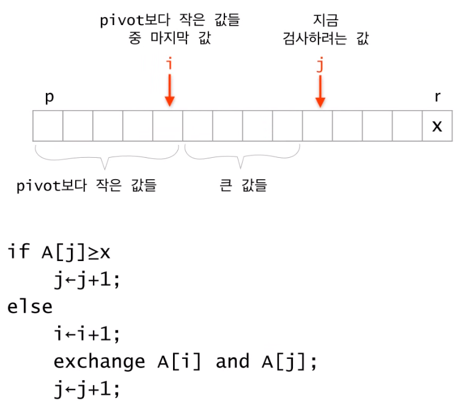
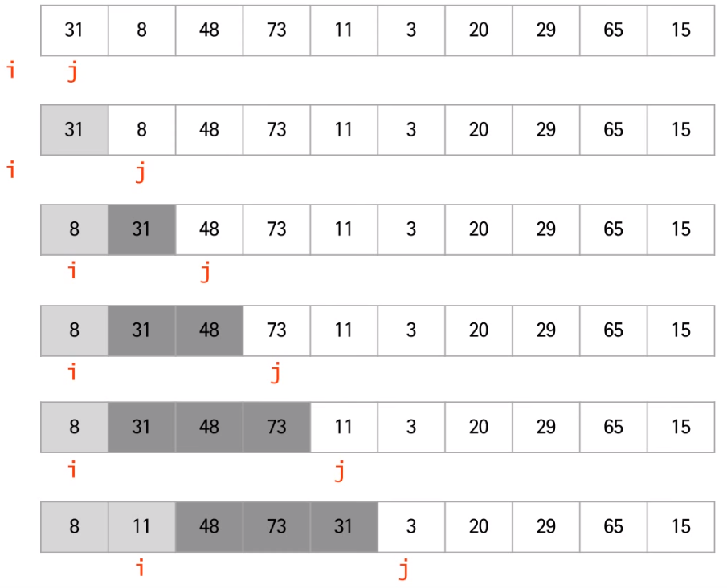
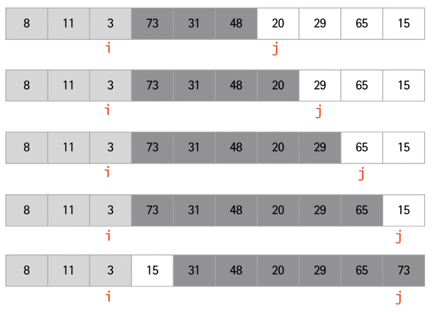

# QuickSort

- 분할정복법을 사용
- 데이터를 분할하는 방법이 merge sort와 다르다.
- 기준 값을 Pivot이라고 함, 예를 들어 처음 값을, 중간 값을, 마지막 값을 기준으로 하는 경우도 있다.
- 이 강의에서는 정렬할 데이터들의 마지막 값을 Pivot으로 사용
- pivot 설정에 따라 성능에 영향을 준다.
- 1) 분할 : 하나의 값을 pivot으로 설정하고, pivot을 중심으로 pivot보다 작은 수들끼리 모으고, pivot보다 큰 수들끼리 모은다.
- 정확히 반반으로 나누어진다는 보장이 없다. 최악의 경우 pivot이 제일 큰 값을 경우
- 따라서 첫 단계는 pivot을 설정하고 pivot을 기준으로 나눈다.
- 2) 정복 : 각 부분을 순환적으로 정렬한다.
- 3) 합병 : 할 게 없음, 이미 작은 것과 큰 것들로 나눴기 때문에 합병할 필요가 없다.

 


# 수도 코드

```
quickSort(A[], p, r) { // 배열 A[]을 시작 인덱스 p 부터 마지막 인덱스 r 까지 정렬한다.
	if(p < r) then {
		q = partition(A, p, r);  // 분할, q 는 pivot 의 위치
		quickSort(A, p, q-1);  // 왼쪽 부분 정렬
		quickSort(A, q+1, r);  // 오른쪽 부분 정렬
	}
}

partition(A[], p, r) {
//마지막 값을 pivot으로 설정
	배열 A[p ... r] 의 원소들을 A[r] 을 기준으로 양쪽으로 재배치하고 A[r] 이 자리한 위치를 return 한다;
	//pivot 자리를 리턴
}
```



-  pivot을 이리저리 옮기는 것은 비효율적이므로 마지막 자리에 고정시켜놓고 나머지 값들을 작은 값들과 큰 값들로 구분
- 그 다음 큰 값들 중 첫 번째 값과 pivot 값을 바꾸면 된다.
- pivot을 제외한 데이터들을 분할할 것인가를 알아본다. 각각의 데이터들을 pivot과 비교할 수밖에 없다. 
- 위 그림에서는 이미 작은 값들과 큰 값들로 구분했고 이제 j를 검사할 차례로 가정
- i 는 작은 값들의 마지막을 알고 있어야 해서 필요
- A[j] 가 pivot 보다 크다면 j의 인덱스를 1 증가시키고, 작다면 i+1번째와 자리를 바꾸고 i 인덱스를 증가, 그 다음 j도 1 증가시키면 작은 값들끼리, 큰 값들끼리 나누어진다.




- 마지막 값 15가 Pivot, i는 작은 값들 중 마지막





# partition 수도 코드

```
Partition(A, p, r) {
	x <- A[r];
	i <- p-1;
	for j <- p to r-1
	if A[j] <= x then
		i <- i+1;
		exchange A[i] and A[j];
	exchange A[i+1] and A[r];
	return i+1;
}
```


# 수행 시간

- n개의 데이터를 비교해야 되니 O(n)
- 최악의 경우 (pivot이 최댓값 혹은 최솟값인 경우)
  - 항상 한 쪽은 0개, 다른 쪽은 n-1개로 분할되는 경우
  - T(n) = O(n^2)
- merge sort O(nlogn) 과 비교했을 시 안 좋음

- 최선의 경우
  - 항상 절반으로 분할되는 경우
  - T(n) = 2T(n/2) + O(n) = O(nlogn)

- QuickSort는 최악의 경우 O(n^2) 인데 어떻게 빠르다고 할 수 있는지?
  - 파티션을 하는데 항상 반으로 나눠지는 경우는 드물다.
  - n-1 / 0 도 일어나기 드물다.
  - Balanced Partition, 너무 극단적으로 나눠지지 않음
  - 그래서 성능은 어떻게 파티션 되는지에 따라 달라지는데 극단적인 경우만 아니면 O(nlogn) 이므로 충분히 빠르다.


# Pivot의 선택

- 첫번째 값이나 마지막 값을 피봇으로 선택(항상 좋은 것은 아니다.)
  - 이미 정렬된 데이터 혹은 거꾸로 정렬된 데이터가 최악의 경우
  - 현실의 데이터는 랜덤하지 않으므로 (거꾸로) 정렬된 데이터가 입력으로 들어올 가능성은 매우 높음
  - 따라서 좋은 방법이라고 할 수 없음
- Median of Three
  - 첫번째 값과 마지막 값, 그리고 가운데 값 중에서 중간값(median)을 피봇으로 선택
  - 최악의 경우 시간복잡도가 달라지지는 않음
  - 현실적으로 첫번째나 마지막 값을 피봇으로 하는 것보다는 낫다.
- Randomized Quicksort
  - 피봇을 랜덤하게 선택
  - no worst cast instance, but worst case execution
  - 평균 시간복잡도 O(NlogN)

