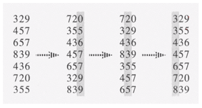

# Sorting in linear time : Radix Sort

- non comparison sort
- n 개의 d 자리 정수들
- 가장 낮은 자리 수부터 정렬
- d = 3, n = 7



- 가장 낮은 자리 수부터 정렬해서 나아간다. 그 다음 바로 윗자리, 반복해서 가장 큰 자리 수까지 정렬해간다. 
- 간단한 알고리즘, 각 자리 정수들을 d 번 반복해서 정렬
- 왜 이렇게 하면 정렬이 되었는지 이해하는 것이 중요
  - 지난 시간 stable sort, 정렬을 할 때 입력 된 데이터가 같은 데이터가 2개 이상 있다면 이 둘의 순서가 유지되도록 입력에서 들어온 순서가 출력에서의 출력 순서와 같게
  - radix sort에서는 stable sort가 중요, 반드시 stable 해야 한다.
  - 예를 들어 위에서 2 번째 자리수 2가 같은 데이터가 2개 있다. 720 329
  - 720 329 순서대로 나와야 함
  - 따라서 매 단계에서 정렬은 stable 해야 한다.
  - 실제로 radix는 counting sort를 사용해서 정렬한다고 생각하면 된다.
  - Counting Sort를 이용하면 좋은 것이 한 자리수를 비교해서 정렬하기 때문에 적합하다. 그리고 숫자가 0 ~ 9 범위 이므로 크지 않으므로 적합
  - 두 번째 자리 정렬 후에 수를 보면 1, 2 번째 자리 수가 정렬되어 있는 것을 알 수 있다.
  - 핵심은 매 단계에서 정렬할 때 사용하는 알고리즘은 stable 하다.

# 수도 코드

```
RADIX-SORT(A, d) { // A: n개 배열, d : d자리 정수
	for i <- 1 to d
		do use a stable sort to sort array A on digit i
} // 여기서 stable sort를 counting sort를 사용한다면 시간복잡도 O(n+k)
```

# 시간 복잡도 O(d(n+k))

- counting sort를 d 번 반복하니까
- d가 상수이고 k < n 이면 O(n)


# 비교

| Sort Algorithm                    | T(n)                        |
| --------------------------------- | --------------------------- |
| bubble, insertion, selection sort | O(n^2)                      |
| quick sort                        | 최악 O(n^2) / 평균 O(nlogn) |
| merge sort                        | O(nlogn)                    |
| heap sort                         | O(nlogn)                    |
| counting sort                     | O(n+k)                      |
| radix sort                        | O(d(n+k))                   |

