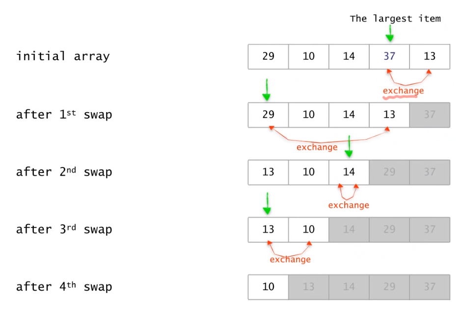
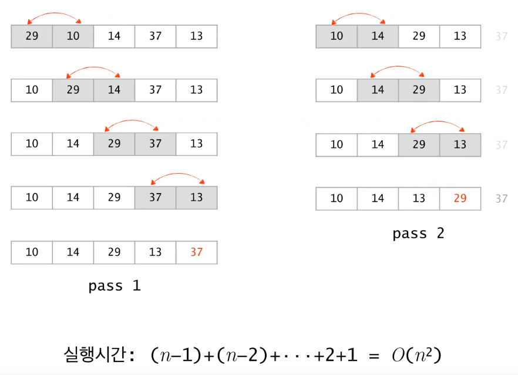
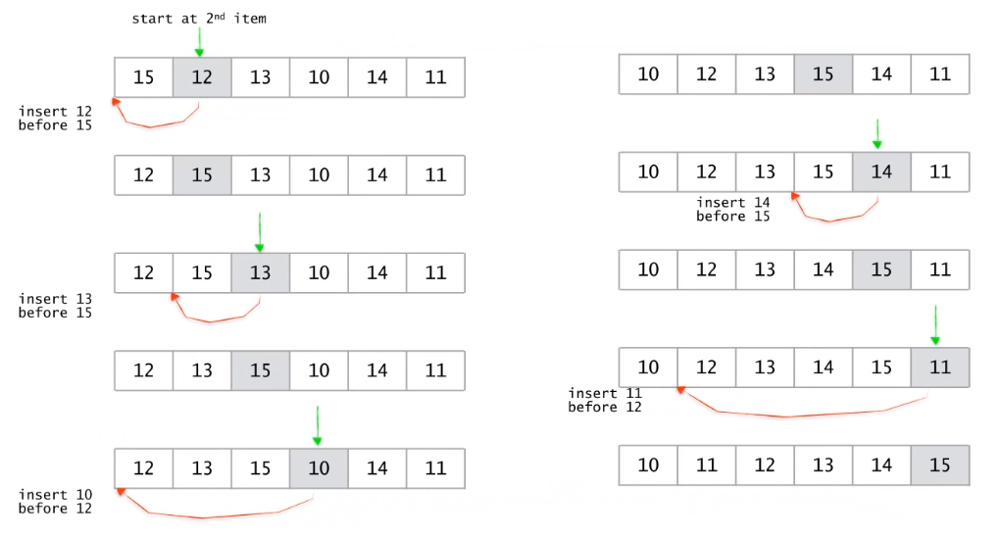
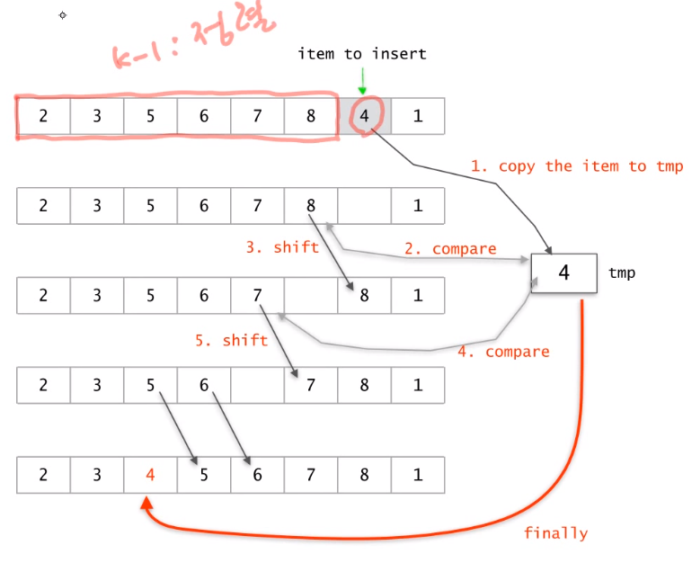

# 제 3장 정렬

## simple, slow (단순하고 이해하기 쉽지만 성능적인 면에서는 좋지 않음)

- bubble sort
- insertion sort
- selection sort

## fast (위 정렬 알고리즘보다 상대적으로 성능적 측면에서 빠름)

- quicksort
- merge sort
- heap sort

## O(N)

- radix sort


# 기본적인 정렬 알고리즘

# Selection sort

- 최대 원소를 찾는다.
- 최대 원소와 맨 오른쪽 원소를 교환
- 맨 오른쪽 원소를 이제 제외한다.
- 이를 하나의 원소가 남을 때까지 반복한다.




##  수도 코드

```
selectionSort(A[], n) {  ------- 배열 A[1 ..  n]을 정렬
	for last <- n downto 2 {   ---------  (1), n부터 2번째 인덱스를 순서대로 맨 마지막으로 보냄, 마지막은 자동이니 2까지
		A[1...last] 중 가장 큰 수 A[k]를 찾는다.   ---------  (2)
		A[k] <-> A[last]; 가장 큰 수를 가장 마지막에 있는 수와 바꾼다.   ---------  (3)
	}
}
```

## 수행시간

- (1) 의 for 루프는 n-1번 반복

- (2) 에서 가장 큰 수를 찾기 위한 비교 횟수 : n-1, n-2, ... , 2, 1 / 예를 들어 3가지 숫자 비교시 2번 하는 것처럼 last-1 번 연산 필요

- (3) 의 교환은 상수 시간 작업

## 시간복잡도

- (2)의  횟수의 총합과 같다.
- n(n-1) / 2

- T(n) = (n-1)+(n-2)+ .... + 2+1 = O(n^2)
- n^2의 경우 최악, 최선, 평균의 경우를 구분할 필요가 없다, 모든 데이터에 경우에 n(n-1) / 2가 나오기 때문이다.


# Bubble Sort



- Selection Sort와 비슷하지만 최댓값을 찾는 과정에서 조금 다르다.

## 수도 코드

```
bubbleSort(A[], n) {  ------- 배열 A[1 ..  n]을 정렬
	for last <- n downto 2 {   ---------  (1)
		for i <- 1 to last-1 {   ---------  (2) 1번째 인덱스부터 마지막 전 인덱스까지
			if(A[i] > A[i+1]) then A[i] <-> A[i+1];   ---------  (3) 크면 서로 교환
		}
	}
}
```

## 수행시간

- (1) 의 for 루프는 n-1번 반복

- (2) 에서 가장 큰 수를 찾기 위한 비교 횟수 : n-1, n-2, ... , 2, 1

- (3) 의 교환은 상수 시간 작업

- T(n) = (n-1)+(n-2)+ .... + 2+1 = O(n^2)


# Insertion Sort



- 하나씩 추가되어서 정렬되는 과정



- 여기서 4을 정렬할 때 앞부터 비교할 수도 있고 뒤부터 비교할 수 있다.
- 여기서는 뒤에서부터 비교하는 것이 효율적이다.
- 위에서 temp 변수에 4를 넣는 이유는 4보다 큰 수를 뒤로 한 칸 이동시키기 위해서이다.


## 수도 코드

```
insertionSort(A[], m) {
	for i <- 2 to n {   ---------  (1)
		A[1 ... i] 의 적당한 자리에 A[i]를 삽입한다.   ---------  (2)
	}
}
```


## 수행시간

- (1) 의 for 루프는 n-1번 반복
- (2) 의 삽입은 최악의 경우 i-1번 비교
- 최악의 경우 T(n) = (n-1) + (n-2) + ... + 2 + 1 = O(n^2)

