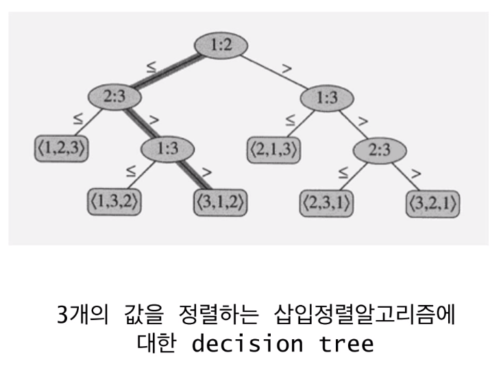

# 정렬의 lower bound

- 시간복잡도 분석, 하한이라고 하면 최악의 시간복잡도가 하한보다 좋아질 수 없다는 것을 의미한다.
- bubble, selection, insertion, quick 정렬은 최악의 경우 O(n^2)
- quick sort는 평균 O(nlogn)
- merge, heap sort은 최악의 경우 O(nlogn)
- 과연 이 nlogn 시간 복잡도가 최선인가? 이것보다 더 나은, 좋은 정렬 알고리즘은 없는가
- 미리 결론을 말하자면 최악의 경우에 nlogn보다 더 나은 정렬 알고리즘이 존재할 수 없다. 하지만 여기에 전제 조건이 하나 달린다. 정렬 알고리즘이 Comparison Sort인 경우에 nlogn보다 낮아질 수 없다.

# Comparison Sort

- 데이터들간의 **상대적 크기관계**만을 이용해서 정렬하는 알고리즘
- 따라서 데이터들간의 크기 관계가 정의되어 있으면 어떤 데이터에든 적용가능(문자열, 알파벳, 사용자 정의 객체 등)
- 버블, 삽입, 합병, 퀵소트, 힙 정렬 등

# Non-comparison Sort

- 정렬할 데이터에 대한 **사전지식**을 이용 - 적용에 제한
- Bucket Sort
- Radix Sort

# 정렬 문제의 하한

- ## 하한 (Lower bound)

  - 입력된 데이터를 한번씩 다 보기 위해서 최소 O(n)의 시간복잡도 필요
  - 합병정렬과 힙 정렬 알고리즘들의 시간복잡도는 O(nlogn)
  - 어떤 Comparison Sort 알고리즘도 O(nlogn) 보다 나을수 없다.

# Decision Tree(의사 결정 나무)

- 의사 결정 규칙과 그 결과들을 트리 구조로 도식화한 의사 결정 지원 도구의 일종이다
- 임의의 comparision sort가 있다고 가정, n개의 데이터가 입력으로 주어줬을 때 정렬을 하기 위해서 값들을 비교할 것이다.
- 비교하는 전체 과정을 트리로 나타낸 것
- 아래는 n = 3 인 경우, insertion sort의 decision tree

- Comparison Sort면 위와 같은 의사결정 트리를 그릴 수 있음
- leaf 노드의 개수는 n! 개, leaf 노드들은 정렬의 결과, n개의 정렬할 수 있는 경우의 수는 n! 이기 때문
- 최악의 시간복잡도는 이 트리의 높이에 비례
- 트리의 높이는 height >= logn! = O(nlogn)

