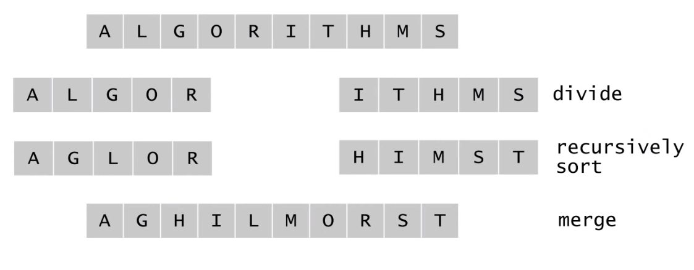

# 합병정렬(merge sort)

# 분할정복법

- merge sort, quick sort 공통적으로 분할정복법을 사용
- merge sort에 대해 알아본다.
- 분할 : 해결하고자 하는 문제를 작은 크기의 동일한 문제들로 분할
- 정복 : 각각의 작은 문제를 순환적으로 해결
- 합병 : 작은 문제의 해를 합하여 원래 문제에 대한 해를 구함


# 합병정렬

- 데이터가 저장된 배열을 절반으로 나눔
- 각각의 순환적으로 정렬
- 졍렬된 두 개의 배열을 합쳐 전체를 정렬 




# 수도 코드

```
mergeSort(A[], p, r) { // 시작 인덱스 p, 마지막 인덱스 r
	if(p < r) then {  // p>r 인 경우는 데이터가 0 또는 1개
		q <- (p+r) / 2;   ----------(1) p와 r의 중간 지점 계산 
		mergeSort(A, p, q);   ----------(2)  전반부 정렬
		mergeSort(A, q+1, r);   ----------(3) 후반부 정렬
		merge(A, p, q, r);   ----------(4) 합병
	}
}

merge(A[], p, q, r) {
	정렬되어 있는 두 배열 A[p ... q]와 A[q+1 ... r] 을 합하여
	정렬된 하나의 배열 A[p ... r] 을 만든다.
}
```

- merge sort는 기본적으로 재귀를 호출하므로 매개변수에도 p, r 인덱스 값이 들어간다.


# merge 코드

```java
void merge(int data[], int p, int q, int r) {
	int i = p, j = q+1, k = p; //k는 tmp의 첫 인덱스, i는 왼쪽 배열 첫 인덱스, j는 오른쪽 배열 첫 인덱스
	int tmp[data.length()];
	while(i<=q && j<=r) { // 앞쪽에 데이터가 적어도 하나 남아있을 경우
		if(data[i] <= data[j]) { // i가 더 작으면 tmp로
			tmp[k++] = data[i++];
		} else { // j가 더 작으면 tmp로
			tmp[k++] = data[j++];
		}
	} // i가 q를 넘어갔거나 j가 r을 넘어갔음, 둘 중에 하나는 끝났다는 것을 의미
	while(i<=q) { // 나머지 그대로 내려옴
		tmp[k++] = data[i++];
	}
	while(j<=r) {
		tmp[k++] = data[j++];
	}
	for(int i=p; i<=r; i++) {
		data[i] = tmp[i]; // 정렬된 것을 data에 넣으면 끝
	}
}
```

- 2 개의 배열(2개라고 하지만 하나의 배열을 반반씩 나눈것)이 각각 정렬되어 있고 그 배열들을 하나의 새로운 배열을 만들어 합병

# 시간복잡도

## T(n)

- 0 (if n = 1)
- T(n/2) + T(n/2) + n(합병시, 데이터 갯수가 n개이니 비교하고 하나씩 내려오니까 n번 비교해서 내려와야 다 내려옴) (otherwise)

- O(nlogn)

