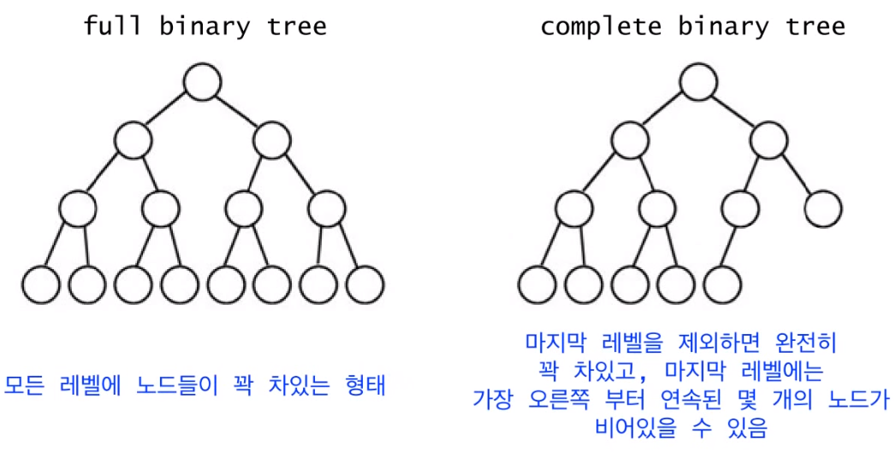
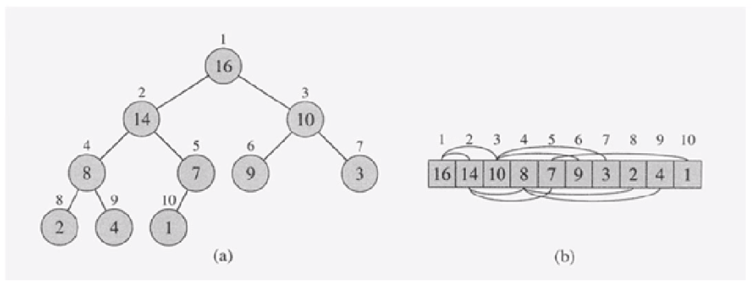
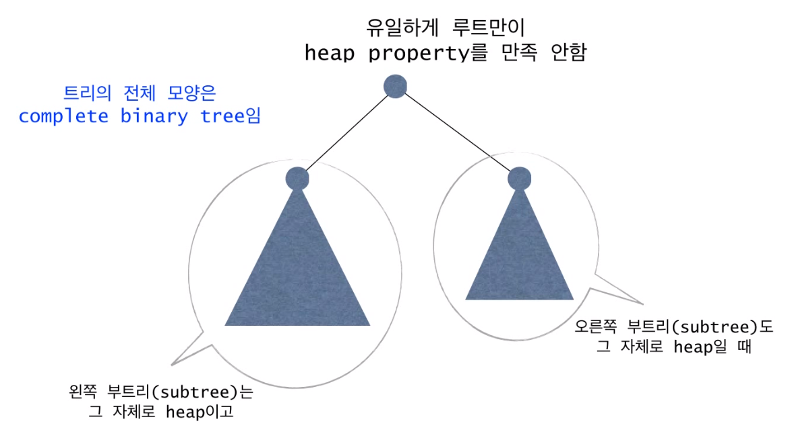
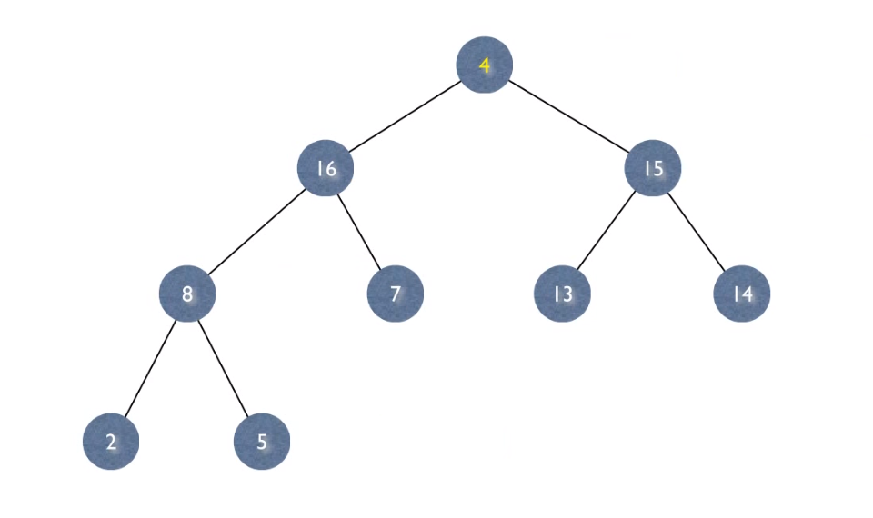
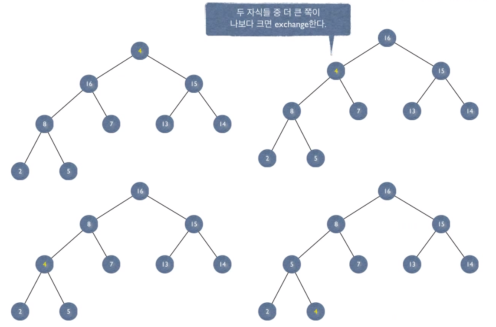
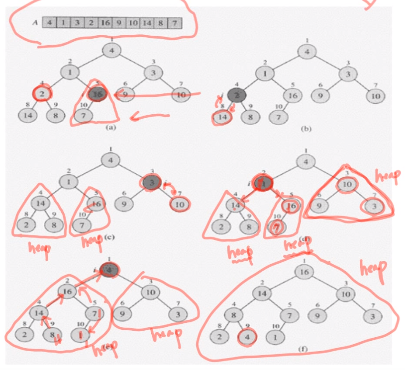
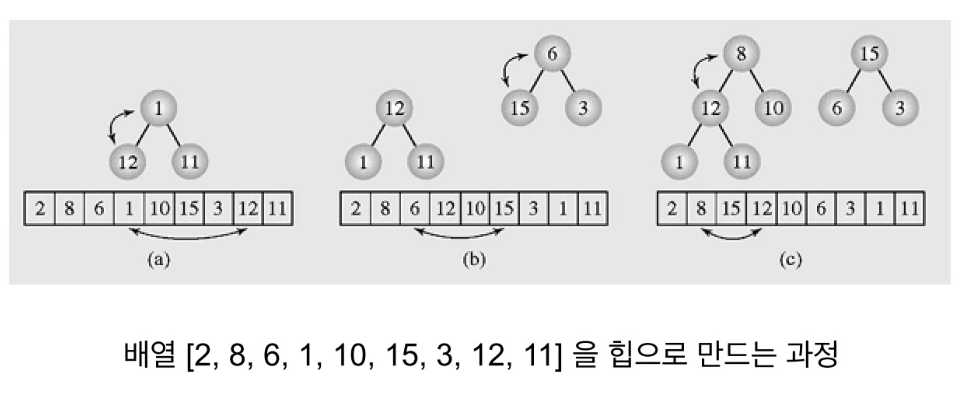
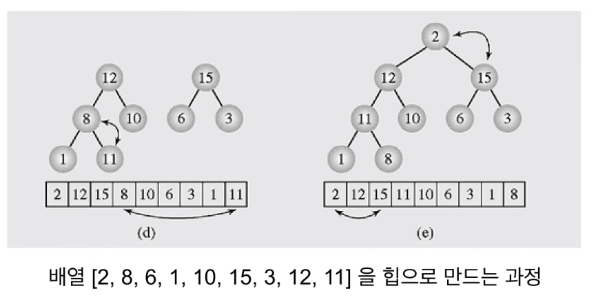
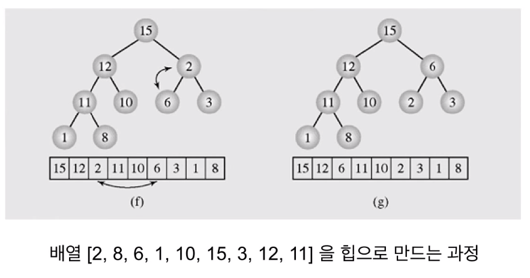

# 힙 정렬

# Heap과 Heapsort

- 최악의 경우 시간복잡도 O(nlog2n)
- merge와 달리 추가 배열 불필요
- binary heap 자료구조를 사용


# Heap의 정의

- Heap은 2가지 조건을 만족해야 한다.
  1. complete binary tree
  2. heap property


## Complete Binary Tree



- 이진트리는 자식을 최대 2개 가질 수 있는 트리를 의미
- 맨 위 부모가 없는 노드를 root라고 한다.


## Heap Property

- max heap property
  - 부모는 자식보다 크거나 같다.
  - 각 노드가 데이터를 가지고 있는데 부모가 가지고 있는 값이 자식이 가지고 있는 값보다 크거가 같은 경우를 말한다.
- min heap property
  - 부모는 자식보다 작거나 같다.

- 이 수업에서는 max heap을 다룬다.


- 힙은 동일한 데이터들을 가졌다고 해도 서로 다른 힙이 될 수 있다, 힙은 유일하지 않다.


# Heap의 표현

- 힙은 일차원 배열로 표현가능 : A[1 .. n] (n은 노드의 갯수)
  - 루트 노드 A[1]
  - A[i] 의 부모 = A[i/2]
  - A[i] 의 왼쪽 자식 = A[2i]
  - A[i] 의 오른쪽 자식 = A[2i+1]





- complete binary tree 이기 때문에 배열로 표현이 가능하다.


# 기본 연산 : MAX - HEAPIFY

- 힙을 사용해 정렬 연산을 할 때 사용한다. 여기서는 Max Property를 적용하므로 MAX - HEAPIFY라고 한다.
- 아래와 같은 경우에 연산을 수행한다.











# MAX-HEAPIFY : recursive version

## 수도 코드

```
MAX-HEAPIFY(A, i) {  // 노드 i 를 루트로 하는 서브트리를 heapify 한다. A는 heap(1차원 배열), 전체 노드를 heapify하는 것이 아님!
	if there is no child of A[i]
		return;
	k <- index of the biggest child of i;  // 자식들 중 큰 값을 k라고 한다.
	if A[i] >= A[k] // 자식보다 크다면 종료
		return;
	exchange A[i] and A[k]; //자식이 더 크다면
	MAX-HEAPIFY(A, k); // 해당 자식이 있는 힙에만 연산해주면 된다.
}
```


# MAX-HEAPIFY :  iterative version

## 수도 코드

```
MAX-HEAPIFY(A, i) {
	while A[i] has a child do // 자식을 가지고 있을 경우 실행
		k <- index of the biggest child of i;
		if A[i] >= A[k]
			return;
		exchange A[i] and A[k];
		i = k;
	end
}
```


# 정렬할 배열을 힙으로 만들기

- 일반 배열은 binary tree로 표현할 수 있지만 heap property를 항상 만족하지 못함 그래서 정렬이 필요
- leaf 노드가 아닌 노드부터 정렬 시작
- 해당 노드를 루트로 하는 서브트리를 정렬
- leaf 노드들을 찾아가면서 heapify 수행





## 수도 코드

```
Build-Max-Heap(A) {
	heap-size[A] <- length[A]  //  정렬할 데이터 개수 n
	for i <- length[A]/2 downto 1  //  for i = n/2 downto 1
		do Max-Heapify(A, i)
}
```




- 9/2 = 4 즉 4번째 1부터 heapify 시작








# Heapsort

- 1) 주어진 데이터로 힙을 만든다.
- 2) 힙에서 최대값(루트)을 가장 마지막 값과 바꾼다. // 최대값을 제일 뒤로 보낸다. 이제 이 값에 대해서는 생각할 필요가 없다.
- 3) 힙의 크기가 1 줄어든 것으로 간주한다. 즉, 가장 마지막 값은 힙의 일부가 아닌 것으로 간주한다.
- 4) 루트노드에 대해서 HEAPIFY(1) 한다.
- 2 ~ 4번을 반복한다.


## 수도 코드

```
HEAPSORT(A)
1. BUILD-MAX-HEAP(A)  : O(n)
2. for i <- heap_size downto 2 do  : n-1 번
3. 	exchange A[1] <-> A[i]  : O(1)
4. 	heap_size <- heap_size - 1  : O(1)
5. 	MAX-HEAPIFY(A,1)  : O(log2n)
```

- Total time : O(nlog2n)