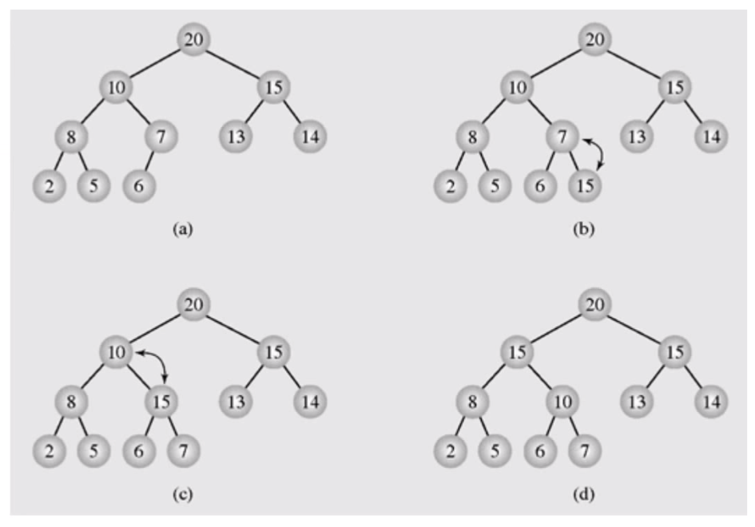
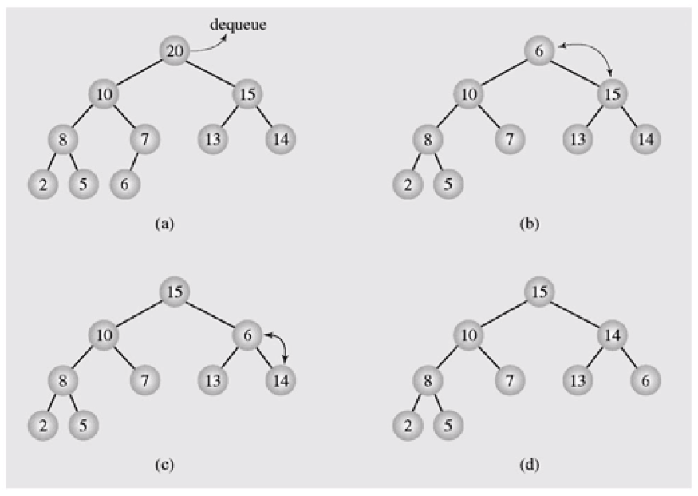

# 힙의 응용 : 우선순위 큐

- 최대 우선순위 큐는 다음의 두 가지 연산을 지원하는 자료구조
  - INSERT(x)	 : 새로운 원소 x를 삽입
  - EXTRACT_MAX() : 최댓값을 삭제하고 반환

- 최소 우선순위 큐
- MAX HEAP을 이용하여 최대 우선순위 큐를 구현
- 여기서는 최대 우선 순위 큐 사용


# INSERT(x)




- MAX HEAP에 15라는 데이터 삽입
- HEAP은 항상 COMPLETE BINARY TREE
- 그래서 데이터 삽입 시에 기존 바로 다음 자리에 추가되어야 한다.
- 이후에는 MAX Property(자식보다 부모의 데이터 값이 커야한다.)를 만족시켜 주는 동작을 수행


# 수도 코드

```
MAX-HEAP-INSERT(A, key) {  // A가 heap, key가 새로 추가할 데이터
	heap_size = heap_size+1; // 데이터를 하나 추가해주기 위해 길이 하나 늘림
	A[heap_size] = key; // 배열의 가장 마지막에 추가. 여기서는 배열의 인덱스를 1부터  시작하기로 함
	i = heap_size; // 문제아 노드 = 마지막 노드
	while(i>1 and A[PARENT(i)] < A[i]) { // 루트 노드가 아니고 부모 노드보다 값보다 클 경우
		exchange A[i] and A[PARENT(i)]; 
		i = PARENT(i);
	}
}
```


## 시간 복잡도 O(log2n)


# EXTRACT_MAX()




- MAX HEAP의 최댓값은 항상 루트에 존재
- 이제 루트에 있는 값을 삭제하고 반환해줘야 함
- 노드의 개수가 하나 줄어야 함
- 삭제시에 아무 노드만 삭제하면 안된다. 트리 모양이 망가질 수 있다.
- 그래서 마지막 노드를 삭제해 줘야 한다.
- 마지막 노드의 데이터를 루트 노드로 옮겨주고 마지막 노드를 삭제해준다.
- 하지만 MAX Property를 만족시켜주기 위해 동작 수행


# 수도 코드

```
HEAP-EXTRACT-MAX(A) {
	if heap_size[A] < 1
		then error "heap underflow"
	max <- A[1]
	A[1] <- A[heap-size[A]]
	heap-size[A] <- heap-size[A]-1
	MAX-HEAPIFY(A,1)
	return max
}
```


## 시간복잡도 O(log2n)